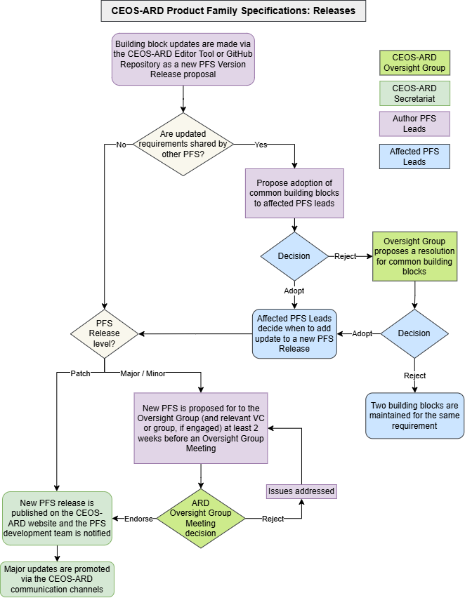
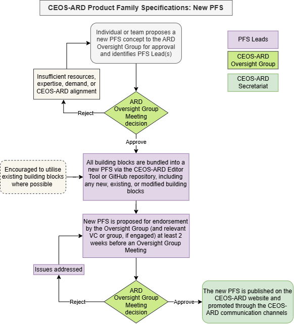
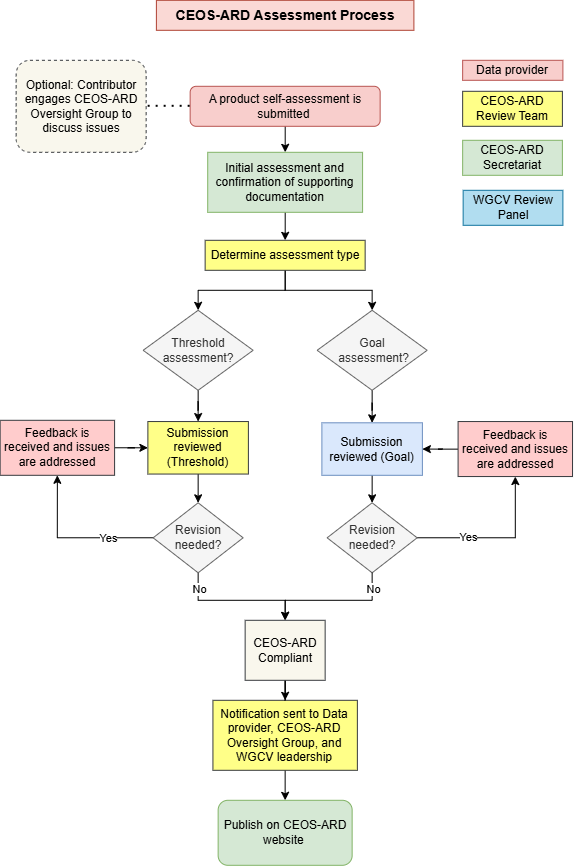

# 1: Framework

## 1.1: Purpose and Overview

The purpose of this document is to present all aspects of the governance of CEOS Analysis Ready Data (CEOS-ARD), including the high-level definition, oversight arrangements, processes for defining certain types of CEOS-ARD (via Product Family Specifications, PFS), and the process by which datasets are assessed and classified as CEOS-ARD.

The CEOS-ARD Framework includes:

* CEOS-ARD definition and oversight
* The role and core elements of the Product Family Specifications (PFS)
* Development process for new PFS
* CEOS-ARD Building Blocks and GitHub 
* Self-assessments and CEOS roles in the process
* Processes for peer review of self-assessments and approval of CEOS-ARD datasets
* Classification and promotion of CEOS-ARD datasets
* The role of Advisory Notes in providing guidance on aspects which are not part of the core Framework.

## 1.2: Definition

*“CEOS Analysis Ready Data are satellite data that have been processed to a minimum set of requirements and organized into a form that allows immediate analysis with a minimum of additional user effort and interoperability both through time and with other datasets.”*

## 1.3: Oversight

The CEOS-ARD Oversight Group coordinates development and implementation of the CEOS-ARD initiative, and maintains the CEOS-ARD Strategy and Governance Framework. The Oversight Group is led by a CEOS Agency representative nominated by the SIT Chair and participants are nominated representatives from CEOS of the CEOS Virtual Constellations, Working Groups, and CEOS leadership teams.

CEOS-ARD Oversight Group meetings including the above participants and others as appropriate. Oversight Group meetings are held alongside other CEOS meetings (e.g., LSI-VC, SIT, SIT Technical Workshop) as well as periodically via teleconference to consider cross-cutting matters and other leadership matters related to CEOS-ARD. Refer to the [CEOS-ARD Oversight Group Terms of Reference](https://ceos.org/document_management/Meetings/SIT/SIT-37/Documents/CEOS%20ARD%20Oversight%20Group%20Terms%20of%20Reference%20v1.0%2015%20March%202022.pdf) for more information.

# 2: Product Family Specifications (PFS)

## 2.1: Purpose

Product Family Specifications (PFS) are the core component of the CEOS-ARD concept and describe specifications for certain measurement types. PFS are a flexible and extensible framework to detail specific requirements that a dataset must satisfy in order to be classified as CEOS-ARD for a particular geophysical variable.

The CEOS-ARD website ([ceos.org/ard](http://ceos.org/ard)) maintains the most current and authoritative version of these PFS documents for visibility, as traditional Word and PDF documents. The [CEOS-ARD GitHub repository](../) hosts the most up-to-date, working versions of PFS requirements. All requirements are organised into metadata categories in the ["requirements"](../requirements/README.md) folder of the repository.

The exact form of the PFS (i.e., which items / parameters appear in the documents’ tables) will differ from one product family to the next, because the measurement, instrumentation, mode of observation, levels of maturity, expectation of the user community, etc. will differ between product types.

The PFS detail two levels of requirements – 'Threshold' and 'Goal'. The Threshold level is the minimum level to meet the requirement, whereas the Goal level will represent the leading edge and may not be achievable by all data providers at the time of setting the specification. Goal levels could be interpreted as aspirational requirements, which may be desirable but not necessary characteristics. 

## 2.2: Development

CEOS Virtual Constellations (VC) traditionally serve as the fora in which new PFS are proposed and developed, however specifications can be proposed to the CEOS-ARD Oversight Group by any individual or group of people. CEOS-ARD Oversight Group approval is required before a specification will be adopted into the CEOS-ARD Framework, and as such, consultation prior to embarking on any effort to define a new specification is highly recommended.

At the individual requirement level, contributions are encouraged and welcome at any time via the CEOS-ARD GitHub. For more information on how to contribute to the development of PFS, please refer to [CONTRIBUTING.md](../CONTRIBUTING.md).

### 2.2.1: Resources and Consultation

**Resources**: The development of a PFS requires significant and sustained effort, including convening of meetings with interest groups to develop shared understanding, gather input, and agree on and communicate the specification.

**Demand**: PFS will be developed when producers, experts and users perceive that there is a benefit and are prepared to invest in the effort to develop a PFS, manage the process, and undertake to produce compliant data.

**Leadership**: A point of contact will be identified for each PFS. Each PFS requires a clear owner and the leadership needs to include key stakeholders and the expertise necessary for the definition of the product. PFS leadership is encouraged through, but not limited to the CEOS Virtual Constellations.

**Engagement**: The development of PFS must consider both the user needs and the ability of data providers to meet the specifications. Participation should be sought from CEOS Working Groups, the commercial sector, academia, and other thematic observation coordination bodies. In particular, involving data providers and data volume experts is vital to ensure CEOS-ARD requirements are feasible and appropriate.

**Reporting**: New PFS must be approved by the CEOS-ARD Oversight Group. To facilitate the development of a new PFS, information and experience will be freely shared within CEOS through the point of contact.

PFS Leads should recognise the balance between meeting user needs and maintaining operational viability. Context and justification should accompany requirement updates that tie to user needs and anticipated use, especially for per-pixel metadata. Open dialogue is encouraged between a PFS’ expectations and the current technical capabilities of providers, and PFS Leads should take feedback on board for future PFS version releases.

### 2.2.2: Consistency

Where applicable, metadata requirements are shared between PFS, increasing interoperability between different CEOS-ARD and easing compliance and assessment burden for data providers. The CEOS-ARD Oversight Group is tasked with maintaining and improving CEOS-ARD metadata consistency and should receive inputs from PFS developers.

While there is high-level commonality between PFS facilitated by the CEOS-ARD building blocks (detailed in 2.3 below), many requirements will vary for different types of measurand. The PFS are intended to be flexible in this regard (e.g., a radar PFS may include requirements that are not applicable to an optical sensor PFS, and vice versa).

### 2.2.3: PFS Versioning Convention

With each update to PFS, a new version number is issued. Version numbers will be advanced in accordance with [semantic versioning](https://semver.org/), which increments version numbers by ‘major’, ‘minor’, and ‘patch’ updates in the order major.minor.patch. Data providers compliant with a legacy PFS version will not lose their CEOS-ARD compliance for this version, but are encouraged to self-assess their products against the newest version.

Every proposed change to a CEOS-ARD requirement or PFS via GitHub is recorded with an appropriate level classification (major, minor, or patch). When a new PFS is released, its version number reflects the highest level change since the last release.

* ‘Major’ updates constitute any breaking change(s) to the PFS, whereby an update will affect the compliance of an existing product. Examples include:
  * Introducing a new Threshold requirement or introducing new conditions to an existing one.
  * Changing a dependency to another stricter requirement
  * Broadening what a threshold requirement applies to, so that it now constrains product aspects it did not constrain before
* ‘Minor’ updates constitute content additions or changes to the PFS that retain backward compatibility with the major version. Minor updates should not affect the compliance of existing products under the current major version. Examples include:
  * Relaxing a Threshold requirement (e.g., removed or more lenient conditions)
  * Introducing or editing a Goal requirement
* ‘Patch’ updates impose no changes to the normative meaning for requirements. Examples include:
  * Editorial changes (e.g., fixing typos or grammar)
  * Clarifications to a requirement (without changing its meaning)
  * Formatting updates
  * Updating the *glossary, description, references, changes, or history* fields of a requirement.

For more information on CEOS-ARD versioning, see [VERSIONING.md](../VERSIONING.md).   

## 2.3: CEOS-ARD Building Blocks

### 2.3.1: Overview

The CEOS-ARD building blocks modularise the individual parameter-requirement pairs from the existing CEOS-ARD PFS (subsequently referred to as ‘building blocks’) into separate files that can be naturally stored in the CEOS-ARD GitHub repository, therefore benefiting from the collaborative software development environment inherent to GitHub. This modularisation allows smaller groups to work on individual building blocks, while maintaining visibility and providing mechanisms to ensure consistency across the PFS.

Each of the building blocks have a unique identifier, and are assembled to form the PFS (through ‘assembly manifests’). PFS authors choose from existing blocks, or create their own, to construct their own PFS for consideration. The idea is to have a minimal number of blocks that are unique to a specific PFS, but it will naturally be inevitable that there are some unique requirements. These PFS are then rendered as human readable Word, PDF, and HTML PFS documents, with versioning implemented as described above. The building blocks and the PFS are available directly via GitHub in a manner that is more amenable to machine readability.

Anyone with a GitHub account can contribute pull requests and initiate discussion on CEOS-ARD building blocks, assembly manifests, and all other aspects of the CEOS-ARD Framework.

#### Building Block Best Practices

The following list presents recommended best practices for developing CEOS-ARD building blocks. Building blocks should be:

* Aligned with the YAML structure detailed in the [CEOS-ARD GitHub repository](../requirements/README.md).
* Explicit and unambiguous, and objectively assessable, allowing for a clear binary assessment (met or not met). Conditional phrases such as 'if/where possible' are incompatible.
* Small, atomic, and meaningful to maximise reuse and minimise duplication across different PFS. Common building blocks should be consistent across PFS.   
* Implementation-neutral, describing the information required, not the process. 
* Self-contained, with dependencies on other building blocks identified where necessary.
* Containing clearly-stated dependencies between other building blocks.
* Consistent with agreed vocabularies such as the [CEOS EO Glossary](https://ceos-org.github.io/eo-glossary/). Where definitions for terms do not exist in the CEOS EO Glossary, PFS Leads are encouraged to propose definitions or begin discussions within the glossary.
* Accompanied by recorded *Changes* when updated. Changes to individual building blocks or PFS documents should explicitly describe their effects and justification.
* Aligned with and providing references to existing standards where applicable.
* Retained and marked in the case of deprecation, rather than removed immediately.
* Suitable for automated validation to the greatest extent possible. 

### 2.3.2: Updating PFS

The following steps outline the process for proposing a new release of an existing CEOS-ARD PFS.

1. The PFS Leads propose updates to CEOS-ARD building blocks via the CEOS-ARD Editor Tool or GitHub Repository. Updates are bundled into a proposal for a new PFS Version Release.
2. If any building blocks within the release proposal are shared by other PFS, the PFS Leads propose to affected PFS Leads that common building blocks be adopted.
   * If no updated building blocks are shared by other PFS, skip to Step 5
3. If the Affected PFS Leads accept the originating PFS Leads’ proposal, they may decide when to add the updated building blocks to a new PFS release of their own. If the Affected PFS Leads reject the proposal, the Oversight Group should propose a resolution for common building blocks.
4. If the Affected PFS Leads accept the Oversight Group’s proposal, they may decide when to add the updated building blocks to a new PFS Release of their own. If the Affected PFS Leads reject the proposal, separate building blocks may be maintained for affected and originating PFS.
5. Is the PFS Version classified as a Major, Minor, or Patch Release?
   * For a Patch Release, skip to Step 7\.
6. For a Major or Minor Release, the PFS Leads present the new Version for endorsement by the Oversight Group (and relevant VC or other group, if engaged) at least two weeks before an Oversight Group meeting (in-person meeting or teleconference). A link to the PFS, generated in the CEOS-ARD GitHub repository, should be shared with the Oversight Group *\<[ard-oversight-group@lists.ceos.org](mailto:ard-oversight-group@lists.ceos.org)\>* via email. 
   * If the proposal is rejected, the PFS Leads address issues, iterate updates with the Oversight Group as needed, and repeat this step.
7. Once approved by the Oversight Group, the CEOS-ARD Secretariat publishes the new PFS version on the CEOS-ARD website. For Major updates, the new PFS Version is promoted through the CEOS-ARD communication channels.

*Flowchart for updating CEOS-ARD Product Family Specifications*

#### Recording Changes

Every building block change must be recorded in the file’s *changes* field, including the date, author, level (major, minor, or patch), a description of the change, and reason. Changes to a PFS document must also be recorded in the PFS file’s *changes* field. See ["Recording Changes"](../VERSIONING.md#recording-changes) for an example *changes* record.

### 2.3.2: New PFS

The following steps outline the process for proposing a new CEOS-ARD PFS:

1. An individual or group proposes a new PFS concept to the CEOS-ARD Oversight Group for approval and identifies the PFS Lead(s).
2. The CEOS-ARD Oversight Group approves or rejects the PFS concept. The concept may be rejected if insufficient resources, expertise, user demand, or alignment with the CEOS-ARD framework are evident.
3. The established PFS team bundles all building blocks into a new PFS, including any new, existing, or modified building blocks. The utilisation of existing building blocks is encouraged, where possible.
4. The PFS Leads present the new PFS for endorsement to the CEOS-ARD Oversight Group (and relevant VC or group, if engaged) at least 2 weeks before an Oversight Group meeting (in-person meeting or teleconference). A link to the PFS, generated in the CEOS-ARD GitHub repository, should be shared with the CEOS-ARD Oversight Group *\<[ard-oversight-group@lists.ceos.org](mailto:ard-oversight-group@lists.ceos.org)\>* via email. If the proposal is rejected, the PFS Leads address issues, iterate updates with the Oversight Group as needed, and repeat this step.
5. The CEOS-ARD Secretariat publishes the new PFS version on the CEOS-ARD website and promotes it through the CEOS-ARD communication channels.

*Flowchart for developing new CEOS-ARD Product Family Specifications*

## 2.4\. Processing Levels
CEOS-ARD adopts the following product level classification / taxonomy ([Strobl, 2023](https://www.researchgate.net/publication/375422400_A_REVISED_PROCESSING_LEVEL_SCHEME_FOR_EARTH_OBSERVATION_DATA)) to classify CEOS-ARD compliant datasets in a consistent manner. 

|  |  |  | [Measurand](https://ceos-org.github.io/eo-glossary/terms/measurand) |  |  |  |
| ----- | :---- | ----- | ----- | ----- | ----- | ----- |
|  |  | 0: Raw | 1: Sensor Calibrated | 2: Target Calibrated | 3: Homogenised | 4: Derived |
|  | A: Raw |  |  |  |  |  |
|  | B: Geo-referenced |  | $${\color{green}L1B}$$ | $${\color{green}L2B}$$ | $${\color{green}L3B}$$ |  |
| Geometry | C: Georectified |  | $${\color{yellow}L1C}$$ | $${\color{yellow}L2C}$$ | $${\color{yellow}L3C}$$ | $${\color{green}L4C}$$ |
|  | D: Regridded 1 |  | $${\color{red}L1D}$$ | $${\color{red}L2D}$$ | $${\color{yellow}L3D}$$ | $${\color{yellow}L4D}$$ |
|  | E: Regridded 2 |  |  |  | $${\color{red}L3E}$$ | $${\color{red}L4E}$$ |

| Key | $${\color{green}Ideal}$$ | $${\color{yellow}Tolerable}$$ | $${\color{red}Not \space \color{red}Ideal}$$ |
| :---: | :---: | :---: | :---: |

*CEOS-ARD Processing Level Matrix*

Where the stated measurand and geometric refinement steps refer to:

| Step | Process description |
| :---- | :---- |
| (Raw) | The complete and unaltered/unprocessed set of data acquired by one or several *sensors* on a platform |
| M/**0**: **Uncalibrated** | Unaltered/unprocessed Level 0 *(main) sensor data* annotated with processed *ancillary data* and supplemented by auxiliary data (including radiometric and geometric calibration coefficients and geo-referencing parameters) allowing further processing to higher Levels. |
| M/**1**: **Sensor-calibrated** | Level M/0 sensor data which have been calibrated (ideally traceable to SI) and spatially aligned (colocated, eventually co-gridded) to represent **at-sensor measurements** (value and uncertainty) in sensor nominal spatiotemporal sampling, supplemented by appropriate ancillary and auxiliary data for further processing. |
| M/**2**: **Target-calibrated**  | Level M/1 data processed to represent **geophysical property values (and uncertainties) for a specified target** (object, feature of interest, e.g. surface reflectance, apparent temperature) derived from M/1 sensor data, as much as possible maintaining the sensors nominal spatial and temporal sampling (observation preserving). |
| M/**3**: **Homogenised** | Level M/1 or M/2 data which have been generalised and integrated across one or several platforms and acquisitions to achieve an increased, more regular or in any other form enhanced spatial or temporal coverage in which states **geophysical values agnostic of the originally acquiring sensor and observation condition** and thus directly comparable. This homogenisation and fusion may include measurand re-calibration to external standards and references including use of modelling, aggregation and interpolation. |
| M**4**: **Derived/inferred** | Model output or results from analyses of Level M/3 (or lower level) data i.e., attributes that might not be directly observable by the sensor(s) but are **derived from observations in combination with other external incl. non-observational data** using techniques like modelling or machine learning (AI). |

*CEOS-ARD Measurand Processing Steps*

| Step | Process description |
| :---- | :---- |
| G/**A**: **Raw** | Individual observations (samples) which are not geolocated |
| G/**B**: **Geolocated / georeferenced** | Each observation is geolocated with documented uncertainty in a (traceable) Geodetic Reference System. At this stage the individual observations can be considered forming an irregular ‘point cloud’ which might also be pseudo-regularised to enhance storage efficiency (‘sensor grid’). |
| G/**C**: **Georectified / gridded** | Observations have been spatially re-sampled to fall within a specified, usually regular, geodetic grid. |
| G/**D**: **Regridded 1** | Observations have been re-sampled from the original geodetic grid into another specified (geodetic) grid. |
| G/**E**: **Regridded 2** | Observations or derived values have been again resampled from the second geodetic grid into a third one. This should under no circumstances be equal to their Stage G/C geodetic grid. |

*CEOS-ARD Geometry Refinement Steps*

# 3\. CEOS-ARD Assessment

Self-assessment is the process in which data providers review each item in a PFS and assess whether their product satisfies the ‘Threshold’ or ‘Goal’ requirements. PFS are written as a form that can be completed by data providers in the self-assessment phase – keeping the process and guidance self-contained for ease of use. Data providers can submit a self-assessment by populating the self-assessment columns of the PFS forms (Word versions) on the [CEOS-ARD website](https://ceos.org/ard/#specs). See the Guide to CEOS-ARD Self-Assessments [here](https://ceos.org/ard/files/User%20Guide/CEOS_ARD%20User%20Guide%20v1_4.pdf) for more details.

Following completion of the self-assessment, a review is undertaken to independently confirm that the specification is met. The key principles of the peer review are:

1. Independence, including that the data provider is not involved in the review;
2. Expertise-based, ensuring that experts in the data products are used in the review;
3. Timeliness and efficiency, ensuring that the work-load is manageable and that data providers receive feedback within a target of two weeks.

#### Submission
* The Data provider submits a complete package that will consist of the self-assessment, sample data, associated metadata, and any other necessary references to the CEOS-ARD Secretariat via email: [ARD-CONTACT@LISTS.CEOS.ORG](mailto:ARD-CONTACT@LISTS.CEOS.ORG).
* The CEOS-ARD Secretariat completes a first pass to ensure the submitted package is complete, and if not, they work with the data provider to resolve any issues.

#### Review
* A nominated representative of the CEOS Working Group on Calibration and Validation (WGCV) provides a peer review of the submission, including:
  * A rapid first pass to confirm all necessary info is present;
  * Confirming the data provider’s self-assessment;
  * Reviewing sample metadata for an overall data quality check;
  * Working with the data provider to address any issues.
* For a Goal assessment, a panel of experts from WGCV is engaged to verify metadata which requires significant knowledge to interpret the evidence provided. 

#### Acceptance
* Products that meet the specification will be accepted as ***Compliant with CEOS-ARD*** and classified as either fully meeting the ‘Threshold’ level plus some degree of the ‘Goal’ level – or perhaps fully compliant for both.
* The CEOS Working Group on Information Systems and Services (WGISS) Connected Data Assets (CDA) team are notified of the newly endorsed CEOS-ARD product and invited to establish a link through the [WGISS Connected Data Assets](https://ceos.org/ourwork/workinggroups/wgiss/access/connected-data-assets/cda-datasets/).

Notification
* The CEOS-ARD Peer Review team from WGCV will promptly notify the data provider and the CEOS-ARD Oversight Group in writing of the outcome of the peer review.

Communication
* Datasets submitted for Peer Review will be listed on [ceos.org/ard\#datasets](http://ceos.org/ard#datasets) – with an ‘Under Peer Review’ tag.
* A dataset that has been accepted as compliant will be listed on [ceos.org/ard\#datasets](http://ceos.org/ard#datasets) – with a ‘CEOS-ARD’ tag.

*Flowchart for CEOS-ARD Product Assessments*

# 4\. CEOS-ARD Tools

## 4.1: GitHub Repository

CEOS-ARD PFS development and contribution is managed through the [CEOS-ARD GitHub repository](../), which supports open community collaboration. The repository is used to host draft PFS, maintain building blocks, track issues, and manage proposals for new or updated building blocks or PFS.

*For CEOS Organisational GitHub Governance, please visit [github.com/ceos-org/github-governance](http://github.com/ceos-org/github-governance)*.

Contribution to CEOS-ARD is welcomed through GitHub issues or pull requests. The procedure for GitHub-based contribution is detailed in the [Contributor Guidelines](../CONTRIBUTING.md). In general, modifications to the PFS are proposed and accepted through pull requests. The requirements for CEOS-ARD Oversight Group review of these modifications are detailed in Section 2.3.

Issues related to CEOS-ARD may be opened in the [Issue Tracker](../issues). This includes issues related to PFS, metadata requirements, self-assessment, or products. Issues are discussed and addressed by the CEOS-ARD Oversight Group, PFS Leads, Issue Contributor, and Secretariat. Where appropriate, the Oversight Group may provide consultation to contributors to support resolution.

## 4.2: Editor tool

The CEOS-ARD Editor tool is a visual interface that enables Contributors to propose modifications to the PFS and building blocks. The tool abstracts the complexities of GitHub while delivering pull requests for the Contributor to the repository. The tool can be used by anyone with a GitHub account, with contributions reviewed and accepted according to Section 2.3.

# 5: Classification and Promotion

## 5.1: Product Family Specifications (PFS)

Endorsed Product Family Specifications are openly available on [ceos.org/ard](https://ceos.org/ard/), and PFS working drafts and the individual building blocks are available in the [CEOS-ARD GitHub repository](../). 

## 5.2: CEOS-ARD Certified Products

Once confirmed as meeting the requirements of CEOS-ARD, satellite EO datasets are added to the [CEOS-ARD Website table](https://ceos.org/ard/index.html#datasets). Data may be accessed through the data provider’s DOI link, along with links to further information (e.g., the data provider’s website, CEOS MIM Database records), sample products, and the completed CEOS-ARD self-assessment and peer review outcome documents.

CEOS-ARD Datasets are interconnected with the [WGISS Connected Data Assets](https://ceos.org/ourwork/workinggroups/wgiss/access/connected-data-assets/cda-datasets/) database, improving the discoverability and accessibility of datasets between CEOS-ARD, ESA’s [FedEO](https://fedeo-client.ceos.org/) (Federated Earth Observation missions access) and NASA’s [IDN](https://search.earthdata.nasa.gov/search?portal=idn) (International Directory Network). CEOS-ARD follows the [Guidance to Enable Discoverability of Specialised Datasets](https://ceos-org.github.io/guidance-to-enable-discoverability-of-specialised-datasets/preface.html) for metadata encoding, to facilitate discovery of CEOS-ARD Datasets through the WGISS Connected Data Assets.

CEOS-ARD Datasets are also promoted via the [CEOS MIM Database](http://database.eohandbook.com/).

## 5.3: Promotion

CEOS-ARD developments are shared with the community frequently to encourage open collaboration, feedback, and awareness. This includes announcements of new compliant products. The CEOS-ARD Oversight Group maintains the CEOS-ARD Newsletter, which it aims to publish every quarter. The newsletter includes information on recent CEOS-ARD endorsements, PFS updates, and recent and upcoming meetings. It is shared to the CEOS-ARD Newsletter mailing list and published at [ceos.org/ceos-ard-newsletter/](https://ceos.org/ceos-ard-newsletter/). 

CEOS-ARD developments are also shared via the CEOS Blog, available at [ceos.org/news](http://ceos.org/news). CEOS-ARD PFS development teams are encouraged to work with the CEOS-ARD Secretariat and CEOS Communication Team to develop and publish blog posts.

The CEOS Communication Team also maintains social media accounts that may be used to promote CEOS-ARD news and updates.

## 5.4: CEOS-ARD Logo

The CEOS-ARD Logo (shown on the right) is the property of the CEOS organization and has been created to allow:

* Data Providers to highlight which of their datasets have been assessed and approved against the CEOS-ARD Product Family Specifications (PFS).
* Data Users to easily identify which datasets have been assessed and approved against the CEOS-ARD Product Family Specifications (PFS).

The CEOS-ARD Logo may only be used in accordance with these conditions. Complying with these conditions grants all users non-exclusive license to use the CEOS-ARD Logo on printed and digital materials.

# 6: Advisory Notes

CEOS-ARD Advisory Notes are intended to provide guidance on aspects such as file formats, etc. which are not part of the core Framework. Advisory Notes will be found on the [CEOS-ARD website](https://ceos.org/ard/) and will be developed by CEOS entities as needed in response to an identified need.

