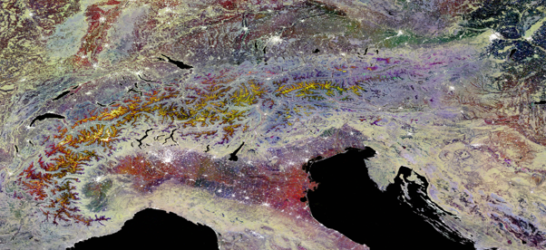

# CEOS-ARD - Synthetic Aperture Radar - Composite Backscatter

&nbsp;

## Draft Version

This is a draft version.
Please visit the [CEOS-ARD website](https://ceos.org/ard) for the latest endorsed version of this document.

## Document Status

Product Family Specification, Synthetic Aperture Radar, Composite Backscatter

Proposed revisions may be provided to: [ard-contact@lists.ceos.org](mailto:ard-contact@lists.ceos.org)

## Document History

### 2026-07-19 (PATCH)

- Fixed the file format specifications/contents for the requirement "Contributing Observations Image"
- Annex (CB Example): Introductory paragraph added.

**Justification:**
Text incorrectly copied from other requirements; clarifications to the Annex.

**Editor:** Ake Rosenqvist

### 2026-07-20 (MINOR)

- The Combined SAR PFS has been split into separate PFS per product type
- Restructured the document; various minor editorial changes; removed empty, irrelevant, or unused parts - many of the changes resulted from the split
- Numerical identifiers were rotated and are deprecated; new textual identifiers have been added
- Moved the Background paragraph about the commonalities and differences in the SAR PFSes to the Introduction
- Requirement "Document identifier": Removed the trailing “for Synthetic Aperture Radar”
- Requirement "Contributing Observations Image": 
- Requirements "Geometric Accuracy" and "Geometric Refined Accuracy": Replaced "For [CB] products" with "For composite products"
- Requirement category "CEOS-ARD Product Data Attributes" renamed to “Product Metadata”; Requirement "Source Data Attributes" renamed to “Source Metadata”. Adapted descriptions accordingly.
- Requirement category "Source Data Attributes": Moved the information about sequential acquisition identifiers to a new threshold requirement “Acquisition ID”. Adapted category description accordingly.
- The subcategories for Source and Product metadata have been flattened into top-level categories
- Annex has been reformatted and updated as required by the split
- Document history has been reset. Check the previous versions for details

**Note:** This document is the successor of the former [CEOS-ARD for SAR PFS v1.3.1](https://ceos.org/ard/files/PFS/SAR/v1.3.1/CEOS-ARD_PFS_SAR_v1.3.1.pdf) for product type **Composite Backscatter (CB)**.

**Justification:**
Migration to building blocks.

**Editor:** Matthias Mohr

## Contributing Authors

- François Charbonneau, Natural Resources Canada, Canada
- Ake Rosenqvist, soloEO / Japan Aerospace Exploration Agency, Japan
- John Truckenbrodt, German Aerospace Centre (DLR), Germany
- Clément Albinet, European Space Agency (ESA), Italy
- David Small, University of Zurich, Switzerland
- Bruce Chapman, Jet Propulsion Laboratory, USA
- Howard Zebker, Stanford University, USA
- Zheng-Shu Zhou, CSIRO, Australia
- Kimberlee Baldry, Geoscience Australia, Australia
- David Bekaert, Jet Propulsion Laboratory, USA
- Virginia Brancato, Jet Propulsion Laboratory, USA
- Danilo Dadamia, CONAE, Argentina
- Benjamin Deschamps, Environment and Climate Change, Canada
- Matt Garthwaite, CSIRO, Australia
- Guillaume Hajduch, Collecte Localisation Satellites, France
- Jayasri Poludasu, ISRO, India
- Josef Kellndorfer, Earth Big Data, USA
- Joseph Kennedy, Alaska Satellite Facility, USA
- Marco Lavalle, Jet Propulsion Laboratory, USA
- Thomas Logan, Alaska Satellite Facility, USA
- Franz Meyer, Alaska Satellite Facility, USA
- Nuno Miranda, European Space Agency (ESA), Italy
- Matthias Mohr, moreGeo GmbH, Germany
- Muriel Pinheiro, European Space Agency (ESA), Italy
- Marko Repse, Sinergise, Slovenia
- HariPriya Sakethapuram, ISRO, India
- Gustavo H. X. Shiroma, Jet Propulsion Laboratory, USA
- Usha Sundari, ISRO, India
- Andreia Siqueira, Geoscience Australia, Australia
- Scott Staniewicz, Jet Propulsion Laboratory, USA
- Takeo Tadono, Japan Aerospace Exploration Agency, Japan
- Medhavy Thankappan, Geoscience Australia, Australia
- Antonio Valentino, Starion for European Space Agency (ESA), Italy
- Anna Wendleder, German Aerospace Centre (DLR), Germany
- Fang Yuan, Digital Earth Africa, Australia
- Francesco De Zan, Delta-Phi Remote Sensing GmbH, Germany

&#12;

## CEOS Analysis Ready Data Definition

> CEOS Analysis Ready Data (CEOS-ARD) are satellite data that have been processed to a minimum set of requirements and organized into a form that allows immediate analysis with a minimum of additional user effort and interoperability both through time and with other datasets.

## Description

**Product Family Specification:**
Synthetic Aperture Radar, Composite Backscatter (CB)

**Version:**
1.1.0-draft

**Applies to:**
Data collected by Synthetic Aperture Radar sensors

## Background

This PFS is specifically aimed at users interested in exploring the potential of SAR but who may lack the expertise or facilities for SAR processing.

The CEOS-ARD Composite Backscatter (CB) product is a composite backscatter product generated from a set of SAR images acquired over a time-window, and where each pixel value is derived from two or more of the input data sources (e.g. by local resolution weighting [@small2022]).
Note the difference with respect to the basic mosaic products accommodated by NRB. CB datasets can be derived from a set of NRB or POL or GSLC inputs, making further use of those products’ backscatter estimates and scattering area per-pixel metadata that were used to normalise them.
The CB source image layers are arranged in a set of input products acquired within a defined time-window, and a single composite backscatter product is the output.
It may contain multiple channels (wavelengths, polarisations).
It is generally assumed that a single composite backscatter image layer will be generated from a set of inputs sharing a common polarisation and wavelength.
The set of input products can be either from a single satellite or mission, or even from multiple missions, given a high standard of geometric and radiometric calibration in all contributing missions.
Further quality per-pixel metadata may also be provided, such as (a) the [@sec:pxl-conobi] or (b) [@sec:pxl-coquama].

&#12;

## Definitions and Abbreviations

<!-- edit:/home/runner/work/ceos-ard/ceos-ard/glossary/acdd.yaml -->
ACDD
:   Attribute Convention for Data Discovery as defined by Earth Science Information Partners (ESIP)

<!-- edit:/home/runner/work/ceos-ard/ceos-ard/glossary/ale.yaml -->
ALE
:   Absolute Geolocation Error

<!-- edit:/home/runner/work/ceos-ard/ceos-ard/glossary/atbd.yaml -->
ATBD
:   Algorithm Theoretical Basis Document

<!-- edit:/home/runner/work/ceos-ard/ceos-ard/glossary/auxiliary-data.yaml -->
Auxiliary Data
:   The data required for instrument processing, which does not originate in the instrument itself or from the satellite. Some auxiliary data will be generated in the ground segment, whilst other data will be provided from external sources, e.g., DEM, aerosols.

<!-- edit:/home/runner/work/ceos-ard/ceos-ard/glossary/cb.yaml -->
CB
:   Composite Backscatter

<!-- edit:/home/runner/work/ceos-ard/ceos-ard/glossary/ceos-ard.yaml -->
CEOS-ARD
:   Committee on Earth Observation Satellites - Analysis Ready Data

<!-- edit:/home/runner/work/ceos-ard/ceos-ard/glossary/composite-product.yaml -->
Composite Product
:   Product where samples (or pixels) are generated from more than one input data source, e.g. by local resolution weighting or by backscatter averaging.

<!-- edit:/home/runner/work/ceos-ard/ceos-ard/glossary/crs.yaml -->
CRS
:   Coordinate Reference System

<!-- edit:/home/runner/work/ceos-ard/ceos-ard/glossary/dem.yaml -->
DEM
:   Digital Elevation Model

<!-- edit:/home/runner/work/ceos-ard/ceos-ard/glossary/doi.yaml -->
DOI
:   Digital Object Identifier

<!-- edit:/home/runner/work/ceos-ard/ceos-ard/glossary/dsm.yaml -->
DSM
:   Digital Surface Model

<!-- edit:/home/runner/work/ceos-ard/ceos-ard/glossary/egm.yaml -->
EGM
:   Earth Gravitational Model

<!-- edit:/home/runner/work/ceos-ard/ceos-ard/glossary/enl.yaml -->
ENL
:   Equivalent Number of Looks

<!-- edit:/home/runner/work/ceos-ard/ceos-ard/glossary/epsg-code.yaml -->
EPSG Code
:   An EPSG code is a unique identifier assigned to e.g. a specific coordinate reference system (CRS) by the European Petroleum Survey Group (EPSG).

<!-- edit:/home/runner/work/ceos-ard/ceos-ard/glossary/grd.yaml -->
GRD
:   Ground Range Detected, a SAR product type

<!-- edit:/home/runner/work/ceos-ard/ceos-ard/glossary/gslc.yaml -->
GSLC
:   Geocoded Single-Look Complex

<!-- edit:/home/runner/work/ceos-ard/ceos-ard/glossary/islr.yaml -->
ISLR
:   Intensity Signal-to-Noise Level Ratio

<!-- edit:/home/runner/work/ceos-ard/ceos-ard/glossary/lut.yaml -->
LUT
:   Look-Up Table

<!-- edit:/home/runner/work/ceos-ard/ceos-ard/glossary/mosaic-product.yaml -->
Mosaic Product
:   Product generated from more than one input data source and where a pixel value in the product uniquely corresponds to the pixel value of one of its input data sources.

<!-- edit:/home/runner/work/ceos-ard/ceos-ard/glossary/nrb.yaml -->
NRB
:   Normalised Radar Backscatter

<!-- edit:/home/runner/work/ceos-ard/ceos-ard/glossary/orb.yaml -->
ORB
:   Ocean Radar Backscatter

<!-- edit:/home/runner/work/ceos-ard/ceos-ard/glossary/pfs.yaml -->
PFS
:   Product Family Specification

<!-- edit:/home/runner/work/ceos-ard/ceos-ard/glossary/pol.yaml -->
POL
:   Polarimetric Radar

<!-- edit:/home/runner/work/ceos-ard/ceos-ard/glossary/pslr.yaml -->
PSLR
:   Polarimetric Signal-to-Noise Level Ratio

<!-- edit:/home/runner/work/ceos-ard/ceos-ard/glossary/rgb.yaml -->
RGB
:   RGB is a color model in which red, green, and blue light are added together in various ways to reproduce a broad array of colors.

<!-- edit:/home/runner/work/ceos-ard/ceos-ard/glossary/rrmse.yaml -->
rRMSE
:   Radial Root Mean Square Error

<!-- edit:/home/runner/work/ceos-ard/ceos-ard/glossary/rtc.yaml -->
RTC
:   Radiometrically Terrain Corrected

<!-- edit:/home/runner/work/ceos-ard/ceos-ard/glossary/sar.yaml -->
SAR
:   Synthetic Aperture Radar

<!-- edit:/home/runner/work/ceos-ard/ceos-ard/glossary/si.yaml -->
SI
:   International System of Units, internationally known by the abbreviation SI (from French Système international d'unités)

<!-- edit:/home/runner/work/ceos-ard/ceos-ard/glossary/slc.yaml -->
SLC
:   Single-Look Complex

<!-- edit:/home/runner/work/ceos-ard/ceos-ard/glossary/stac.yaml -->
STAC
:   SpatioTemporal Asset Catalog

<!-- edit:/home/runner/work/ceos-ard/ceos-ard/glossary/ups.yaml -->
UPS
:   Universal Polar Stereographic

<!-- edit:/home/runner/work/ceos-ard/ceos-ard/glossary/url.yaml -->
URL
:   Uniform Resource Locator, a reference to a web resource that specifies its location on a computer network and a mechanism for retrieving it.

<!-- edit:/home/runner/work/ceos-ard/ceos-ard/glossary/utc.yaml -->
UTC
:   Coordinated Universal Time

<!-- edit:/home/runner/work/ceos-ard/ceos-ard/glossary/utm.yaml -->
UTM
:   Universal Transverse Mercator

<!-- edit:/home/runner/work/ceos-ard/ceos-ard/glossary/wgs84.yaml -->
WGS84
:   World Geodetic System 1984

<!-- edit:/home/runner/work/ceos-ard/ceos-ard/glossary/wkt.yaml -->
WKT
:   Well-Known Text (WKT) is a text markup language for representing vector geometry objects on a map, spatial reference systems of spatial objects, and transformations between spatial reference systems.
The formats were originally defined by the Open Geospatial Consortium (OGC) and described in their Simple Feature Access and Coordinate Transformation Service specifications.

&#12;

## Requirements

**WARNING:** The section numbers in front of the title (e.g. 1.1) are not stable and may change or may be removed at any time.
Do **not** use the numbers to refer back to specific requirements!
Instead, use the textual identifier that is provided below the title.

<!-- todo: remove requirement numbers -->

### <!-- edit:/home/runner/work/ceos-ard/ceos-ard/sections/requirement-categories/general-metadata.yaml-->`1.` General Metadata {#sec:meta label="|General Metadata"}

These are metadata records describing a distributed collection of pixels.
The collection of pixels referred to must be contiguous in space and time.
General metadata should allow the user to assess the _overall_ suitability of the dataset, and must meet the requirements listed below.

#### <!-- edit:/home/runner/work/ceos-ard/ceos-ard/requirements/metadata/traceability-sar.yaml-->`1.1.` Traceability {#sec:meta-trace-sar label="|General Metadata: Traceability"}

Identifier: `meta-trace-sar`

##### Threshold requirements:

Not required.
<!-- *None* -->

##### Goal requirements:

Data must be traceable to SI reference standard.

Notes:

1. Relationship to [@sec:rcm-radacc-sar]. Traceability requires an estimate of measurement uncertainty.
2. Information on traceability should be available in the metadata as a single DOI landing page.

---

#### <!-- edit:/home/runner/work/ceos-ard/ceos-ard/requirements/metadata/machine-readability-sar.yaml-->`1.2.` Metadata Machine Readability {#sec:meta-memare-sar label="|General Metadata: Metadata Machine Readability"}

Identifier: `meta-memare-sar`

##### Threshold requirements:

Metadata is provided in a structure that enables a computer algorithm to be used to consistently and automatically identify and extract each component/variable for further use.

##### Goal requirements:

As threshold, but metadata is formatted in accordance with the latest corresponding CEOS-ARD SAR Metadata Specifications, or in a community endorsed standard that facilitates machine-readability, such as ISO 19115-2, Climate and Forecast (CF) convention and the Attribute Convention for Data Discovery (ACDD), etc.

---

#### <!-- edit:/home/runner/work/ceos-ard/ceos-ard/requirements/metadata/product-type.yaml-->`1.3.` Product Type {#sec:meta-protype label="|General Metadata: Product Type"}

Identifier: `meta-protype`

##### Threshold requirements:

CEOS-ARD product type name – or names in case of compliance with more than one product type – and, if required by the data provider, copyright.

##### Goal requirements:

As threshold.
<!-- *None* -->

---

#### <!-- edit:/home/runner/work/ceos-ard/ceos-ard/requirements/metadata/pfs-url.yaml-->`1.4.` Document Identifier {#sec:meta-pfsurl label="|General Metadata: Document Identifier"}

Identifier: `meta-pfsurl`

##### Threshold requirements:

Reference to CEOS-ARD PFS document as URL.

##### Goal requirements:

As threshold.
<!-- *None* -->

---

#### <!-- edit:/home/runner/work/ceos-ard/ceos-ard/requirements/metadata/time-sar.yaml-->`1.5.` Data Collection Time {#sec:meta-time-sar label="|General Metadata: Data Collection Time"}

Identifier: `meta-time-sar`

##### Threshold requirements:

Number of source data acquisitions of the data collection is identified.
The start and stop UTC time of data collection is identified in the metadata, expressed in date/time.
In the case of composite or mosaic products, the dates/times of the first and last data takes is provided with the product.

##### Goal requirements:

As threshold, but using ISO 8601 time format.

### <!-- edit:/home/runner/work/ceos-ard/ceos-ard/sections/requirement-categories/source-metadata.yaml-->`2.` Source Metadata {#sec:src label="|Source Metadata"}

Metadata describing (detailing) **each** acquisition used to generate the ARD product.

Source data attribute information can refer to other products for higher level ARD derived from those, under the condition of their availability (@sec:src-daccess-src).

#### <!-- edit:/home/runner/work/ceos-ard/ceos-ard/requirements/metadata/acquisition-id.yaml-->`2.1.` Acquisition ID {#sec:src-macqid label="|Source Metadata: Acquisition ID"}

Identifier: `src-macqid`

##### Threshold requirements:

Source data attribute information are described for each acquisition and sequentially identified e.g. as acqID = 1, 2, 3, …

##### Goal requirements:

As threshold.
<!-- *None* -->

---

#### <!-- edit:/home/runner/work/ceos-ard/ceos-ard/requirements/metadata/data-access-source.yaml-->`2.2.` Source Data Access {#sec:src-daccess-src label="|Source Metadata: Source Data Access"}

Identifier: `src-daccess-src`

##### Threshold requirements:

The metadata identifies the location from where the source data can be retrieved, expressed as a URL or DOI.

##### Goal requirements:

The metadata identifies an online location from where the data can be consistently and reliably retrieved by a computer algorithm without any manual intervention being required.

---

#### <!-- edit:/home/runner/work/ceos-ard/ceos-ard/requirements/metadata/instrument-sar.yaml-->`2.3.` Instrument {#sec:src-instru-sar label="|Source Metadata: Instrument"}

Identifier: `src-instru-sar`

##### Threshold requirements:

The instrument used to collect the data is identified in the metadata:

- Satellite name
- Instrument name

##### Goal requirements:

As threshold, but using [CEOS Mission-Instruments-Measurements (MIM) database](https://ceos.org/mim-database) as reference.

---

#### <!-- edit:/home/runner/work/ceos-ard/ceos-ard/requirements/metadata/time-source.yaml-->`2.4.` Source Data Acquisition Time {#sec:src-time-src label="|Source Metadata: Source Data Acquisition Time"}

Identifier: `src-time-src`

##### Threshold requirements:

The start date and time of source data is identified in the metadata, expressed in UTC in date and time, at least to the second.

##### Goal requirements:

As threshold.
<!-- *None* -->

---

#### <!-- edit:/home/runner/work/ceos-ard/ceos-ard/requirements/metadata/acquisition-parameters-sar.yaml-->`2.5.` Source Data Acquisition Parameters {#sec:src-acqpar label="|Source Metadata: Source Data Acquisition Parameters"}

Identifier: `src-acqpar`

##### Threshold requirements:

Acquisition parameters related to the SAR antenna:

- Radar band
- Centre frequency
- Observation mode (i.e., beam mode name)
- Polarization(s) (listed as in original product)
- Antenna pointing (right/left)
- Beam ID (i.e., beam mode mnemonic)

##### Goal requirements:

As threshold.
<!-- *None* -->

---

#### <!-- edit:/home/runner/work/ceos-ard/ceos-ard/requirements/metadata/orbit.yaml-->`2.6.` Source Data Orbit Information {#sec:src-orbit label="|Source Metadata: Source Data Orbit Information"}

Identifier: `src-orbit`

##### Threshold requirements:

Information related to the platform orbit used for data processing:

- Pass direction (asc/desc), see note
- Orbit data source (e.g., predicted, definite, precise, downlinked, etc.)

Note:

1. For source data crossing the North or South Pole, it is recommended to produce two distinct CEOS-ARD products and to use the appropriate “Pass direction” in each.

##### Goal requirements:

As threshold, including also:

- Platform heading angle expressed in degrees (0-360) from North 
- Orbit data file containing state vectors (minimum of 5 state vectors, from 10% of scene length *before* start time to 10% of scene length *after* stop time) 
- Platform (mean) altitude
- Absolute orbit number
- Relative orbit number

---

#### <!-- edit:/home/runner/work/ceos-ard/ceos-ard/requirements/metadata/processing-parameters.yaml-->`2.7.` Source Data Processing Parameters {#sec:src-propar label="|Source Metadata: Source Data Processing Parameters"}

Identifier: `src-propar`

##### Threshold requirements:

Processing parameters details of the source data:

- Processing facility
- Processing date
- Software version
- Product level
- Product ID (file name)
- Azimuth number of looks
- Range number of looks (separate values for each beam, as necessary)

Note:

1. Azimuth and Range number of looks are not required when sources are CEOS-ARD or any other geocoded products

##### Goal requirements:

As threshold, plus additional relevant processing parameters, e.g., range- and azimuth look bandwidth and LUT applied.

---

#### <!-- edit:/home/runner/work/ceos-ard/ceos-ard/requirements/metadata/image-attributes-sar.yaml-->`2.8.` Source Data Image Attributes {#sec:src-imgatt-sar label="|Source Metadata: Source Data Image Attributes"}

Identifier: `src-imgatt-sar`

##### Threshold requirements:

Image attributes related to the source data:

- Source data geometry (slant range/ground range/geocoded)
- Azimuth pixel spacing \[m] (alternatively, azimuth pixel spacing can be provided in second \[s], equivalent to the azimuth time sample interval)
- Range pixel spacing
- Azimuth resolution
- Range resolution 
- Near range incident angle
- Far range incident angle

Note:

1. For geocoded sources such as GSLC and InSAR, Azimuth and Range pixel spacing are replaced by line (row) and pixel (column) spacing information. Spatial resolution information is not required for geocoded sources.

##### Goal requirements:

Geometry of the image footprint expressed in WGS84 in a standardised format (e.g., WKT).

---

#### <!-- edit:/home/runner/work/ceos-ard/ceos-ard/requirements/metadata/performance-indicators.yaml-->`2.9.` Performance Indicators {#sec:src-perfind label="|Source Metadata: Performance Indicators"}

Identifier: `src-perfind`

##### Threshold requirements:

Provide performance indicators on data intensity noise level ($\text{NE}\sigma^0$ and/or $\text{NE}\beta^0$ and/or $\text{NE}\gamma^0$, i.e., noise equivalent Sigma- and/or Beta- and/or Gamma-Nought).
Provided for each polarization channel when available.

Parameter may be expressed as the mean and/or minimum and maximum noise equivalent values of the source data.

Values do not need to be estimated individually for each product, but may be estimated once for each acquisition mode, and annotated on all products.

##### Goal requirements:

Provide additional relevant performance indicators (e.g., ENL, PSLR, ISLR, and performance reference DOI or URL).

---

#### <!-- edit:/home/runner/work/ceos-ard/ceos-ard/requirements/metadata/polarimetric-calibration-matrices.yaml-->`2.10.` Polarimetric Calibration Matrices {#sec:src-polcalm label="|Source Metadata: Polarimetric Calibration Matrices"}

Identifier: `src-polcalm`

##### Threshold requirements:

Not required.
<!-- *None* -->

##### Goal requirements:

The complex-valued polarimetric distortion matrices with the channel imbalance and the cross-talk applied for the polarimetric calibration.

---

#### <!-- edit:/home/runner/work/ceos-ard/ceos-ard/requirements/metadata/ionosphere-indicator.yaml-->`2.11.` Ionosphere Indicator {#sec:src-ionind label="|Source Metadata: Ionosphere Indicator"}

Identifier: `src-ionind`

##### Threshold requirements:

Not required.
<!-- *None* -->

##### Goal requirements:

Flag indicating whether the backscatter imagery is “significantly impacted” by the ionosphere (0 – false, 1 – true).
Significant impact would imply that the ionospheric impact on the backscatter exceeds the radiometric calibration requirement or goal for the imagery.

### <!-- edit:/home/runner/work/ceos-ard/ceos-ard/sections/requirement-categories/product-metadata.yaml-->`3.` Product Metadata {#sec:prd label="|Product Metadata"}

Information related to the CEOS-ARD product generation procedure and geographic parameters.

#### <!-- edit:/home/runner/work/ceos-ard/ceos-ard/requirements/metadata/data-access-product.yaml-->`3.1.` Product Data Access {#sec:prd-daccess-prod label="|Product Metadata: Product Data Access"}

Identifier: `prd-daccess-prod`

##### Threshold requirements:

Processing parameters details of the CEOS-ARD product:

- Processing facility
- Processing date
- Software version
- Location from where CEOS-ARD product can be retrieved, expressed as a URL or DOI.

##### Goal requirements:

The metadata identifies an online location from where the data can be consistently and reliably retrieved by a computer algorithm without any manual intervention being required.

---

#### <!-- edit:/home/runner/work/ceos-ard/ceos-ard/requirements/metadata/auxiliary-data-sar.yaml-->`3.2.` Auxiliary Data {#sec:prd-auxdat-sar label="|Product Metadata: Auxiliary Data"}

Identifier: `prd-auxdat-sar`

##### Threshold requirements:

Not required.
<!-- *None* -->

##### Goal requirements:

The metadata identifies the sources of auxiliary data used in the generation process, ideally expressed as DOIs.

Note:

1. Auxiliary data includes DEMs, etc., and any additional data sources used in the generation of the product.

---

#### <!-- edit:/home/runner/work/ceos-ard/ceos-ard/requirements/metadata/sample-spacing.yaml-->`3.3.` Product Sample Spacing {#sec:prd-samspa label="|Product Metadata: Product Sample Spacing"}

Identifier: `prd-samspa`

##### Threshold requirements:

CEOS-ARD product processing parameters details:

- Pixel (column) spacing
- Line (row) spacing

##### Goal requirements:

As threshold.
<!-- *None* -->

---

#### <!-- edit:/home/runner/work/ceos-ard/ceos-ard/requirements/metadata/enl.yaml-->`3.4.` Product Equivalent Number of Looks {#sec:prd-enl label="|Product Metadata: Product Equivalent Number of Looks"}

Identifier: `prd-enl`

##### Threshold requirements:

Not required.
<!-- *None* -->

##### Goal requirements:

Equivalent Number of Looks (ENL)

---

#### <!-- edit:/home/runner/work/ceos-ard/ceos-ard/requirements/metadata/resolution.yaml-->`3.5.` Product Resolution {#sec:prd-resol label="|Product Metadata: Product Resolution"}

Identifier: `prd-resol`

##### Threshold requirements:

Not required.
<!-- *None* -->

##### Goal requirements:

Average spatial resolution of the CEOS-ARD product along:

- Columns
- Rows

---

#### <!-- edit:/home/runner/work/ceos-ard/ceos-ard/requirements/metadata/filtering-speckle.yaml-->`3.6.` Product Filtering {#sec:prd-spekfil label="|Product Metadata: Product Filtering"}

Identifier: `prd-spekfil`

##### Threshold requirements:

Flag if speckle filter has been applied (true/false).

Metadata should include:

- Reference to algorithm as DOI or URL
- Input filtering parameters
  - Type
  - Window size in pixel units
  - Any other parameters defining the speckle filter used

##### Goal requirements:

As threshold.
<!-- *None* -->

---

#### <!-- edit:/home/runner/work/ceos-ard/ceos-ard/requirements/metadata/geo-bbox.yaml-->`3.7.` Product Bounding Box {#sec:prd-geobbox label="|Product Metadata: Product Bounding Box"}

Identifier: `prd-geobbox`

##### Threshold requirements:

Two opposite corners of the product file (bounding box, including any zero-fill values) are identified,
expressed in the coordinate reference system defined in [@sec:prd-crs-sar].

Four corners of the product file are recommended for scenes crossing the Antemeridian, or the North or the South Pole.

##### Goal requirements:

As threshold.
<!-- *None* -->

---

#### <!-- edit:/home/runner/work/ceos-ard/ceos-ard/requirements/metadata/geo-area-sar.yaml-->`3.8.` Product Geographical Extent {#sec:prd-geoarea-sar label="|Product Metadata: Product Geographical Extent"}

Identifier: `prd-geoarea-sar`

##### Threshold requirements:

The geometry of the SAR image footprint expressed in longitude/latitude based on WGS84 (EPSG 4326), in a standardised format (e.g., WKT Polygon).

##### Goal requirements:

As threshold.
<!-- *None* -->

---

#### <!-- edit:/home/runner/work/ceos-ard/ceos-ard/requirements/metadata/image-size.yaml-->`3.9.` Product Image Size {#sec:prd-imgsize label="|Product Metadata: Product Image Size"}

Identifier: `prd-imgsize`

##### Threshold requirements:

Image attributes of the CEOS-ARD product:

- Number of lines
- Number of pixels per line
- File header size (if applicable)
- Number of no-data border pixels (if applicable)

##### Goal requirements:

As threshold.
<!-- *None* -->

---

#### <!-- edit:/home/runner/work/ceos-ard/ceos-ard/requirements/metadata/pixel-coordinate-convention.yaml-->`3.10.` Product Pixel Coordinate Convention {#sec:prd-pixcoco label="|Product Metadata: Product Pixel Coordinate Convention"}

Identifier: `prd-pixcoco`

##### Threshold requirements:

Coordinate referring to the centre, the upper left corner, or the lower left corner of a pixel.
Values are pixel centre, pixel ULC or pixel LLC.

##### Goal requirements:

As threshold.
<!-- *None* -->

---

#### <!-- edit:/home/runner/work/ceos-ard/ceos-ard/requirements/metadata/crs-sar.yaml-->`3.11.` Product Coordinate Reference System {#sec:prd-crs-sar label="|Product Metadata: Product Coordinate Reference System"}

Identifier: `prd-crs-sar`

##### Threshold requirements:

The metadata lists the map projection (or geographical coordinates, if applicable) that was used and any relevant parameters required to geolocate data in that map projection, expressed in a standardised format (e.g., WKT).

Indicate EPSG code, if defined for the CRS.

##### Goal requirements:

As threshold.
<!-- *None* -->

---

#### <!-- edit:/home/runner/work/ceos-ard/ceos-ard/requirements/metadata/processing-cb.yaml-->`3.12.` CB Processing {#sec:prd-procb label="|Product Metadata: CB Processing"}

Identifier: `prd-procb`

##### Threshold requirements:

Reference to composite backscatter generation method used

- Methodology name
- Reference to methodology (DOI)
- Specific input parameters used

##### Goal requirements:

As threshold.
<!-- *None* -->

### <!-- edit:/home/runner/work/ceos-ard/ceos-ard/sections/requirement-categories/per-pixel-metadata.yaml-->`4.` Per-Pixel Metadata {#sec:pxl label="|Per-Pixel Metadata"}

The following minimum metadata specifications apply to each pixel.
Whether the metadata is provided in a single record relevant to all pixels or separately for each pixel is at the discretion of the data provider.
Per-pixel metadata should allow users to **discriminate between** (choose) observations on the basis of their individual suitability for application.

#### <!-- edit:/home/runner/work/ceos-ard/ceos-ard/requirements/metadata/machine-readability-sar.yaml-->`4.1.` Metadata Machine Readability {#sec:pxl-memare-sar label="|Per-Pixel Metadata: Metadata Machine Readability"}

Identifier: `pxl-memare-sar`

##### Threshold requirements:

Metadata is provided in a structure that enables a computer algorithm to be used to consistently and automatically identify and extract each component/variable for further use.

##### Goal requirements:

As threshold, but metadata is formatted in accordance with the latest corresponding CEOS-ARD SAR Metadata Specifications, or in a community endorsed standard that facilitates machine-readability, such as ISO 19115-2, Climate and Forecast (CF) convention and the Attribute Convention for Data Discovery (ACDD), etc.

---

#### <!-- edit:/home/runner/work/ceos-ard/ceos-ard/requirements/per-pixel/data-mask.yaml-->`4.2.` Data Mask Image {#sec:pxl-damaski label="|Per-Pixel Metadata: Data Mask Image"}

Identifier: `pxl-damaski`

##### Threshold requirements:

Mask image indicating:

- Valid data
- Invalid data
- No data

File format specifications/contents provided in metadata:

- Sample Type (Mask)
- Data Format (GeoTIFF, HDF5, NetCDF, …)
- Data Type (Int, …)
- Bits per Sample
- Byte Order
- Bit Value Representation

Notes:

1. All bit value representations included in the Data Mask Image should be indicated in the metadata.
2. For CEOS-ARD products created from repeat-pass acquisitions, with narrow orbital tube radius, a single static per pixel metadata file can be provided as a URL address of that unique metadata file.

##### Goal requirements:

As threshold, including additional bit value representations, e.g.:

- Layover (masked as invalid data in threshold)
- Radar shadow (masked as invalid data in threshold)
- Ocean water
- Land (recommended for ORB)
- RTC applied (e.g., for maritime scenes with land samples for which RTC has been applied)
- DEM gap filling (i.e., interpolated DEM over gaps)

---

#### <!-- edit:/home/runner/work/ceos-ard/ceos-ard/requirements/per-pixel/noise-power.yaml-->`4.3.` Noise Power Image {#sec:pxl-pinopow label="|Per-Pixel Metadata: Noise Power Image"}

Identifier: `pxl-pinopow`

##### Threshold requirements:

Not required.
<!-- *None* -->

##### Goal requirements:

Estimated Noise Equivalent $\sigma^0$ (or $\beta^0$ or $\gamma^0$, as applicable) used for noise removal, if applied, for each channel.
$\text{NE}\sigma^0$ and $\text{NE}\gamma^0$ are both based on either an ellipsoid Earth model or the local topography.

File format specifications/contents provided in metadata:

- Sample Type (Gamma-Nought, Sigma-Nought, Beta-Nought)
- Correction model type (Ellipsoid, Topography)
- Data Format (GeoTIFF, HDF5, NetCDF, …)
- Data Type (Int, Float, …)
- Bits per Sample
- Byte Order

Note:

1. The same compositing algorithm as for backscatter shall be used.

---

#### <!-- edit:/home/runner/work/ceos-ard/ceos-ard/requirements/per-pixel/acquisition-id-composite.yaml-->`4.4.` Acquisition ID Image {#sec:pxl-pacqidc label="|Per-Pixel Metadata: Acquisition ID Image"}

Identifier: `pxl-pacqidc`

##### Threshold requirements:

Not required.
<!-- *None* -->

##### Goal requirements:

The source IDs for each pixel are identified.

File format specifications/ contents provided in metadata:

- Sample type (ID)
- Data Format (GeoTIFF, HDF5, NetCDF, …)
- Data Type (Int, Float, …)
- Bits per sample
- Byte Order

---

#### <!-- edit:/home/runner/work/ceos-ard/ceos-ard/requirements/per-pixel/dem.yaml-->`4.5.` Per-Pixel DEM {#sec:pxl-pidem label="|Per-Pixel Metadata: Per-Pixel DEM"}

Identifier: `pxl-pidem`

##### Threshold requirements:

Not required.
<!-- *None* -->

##### Goal requirements:

Provide DEM or DSM as used during the geometric and radiometric processing of the SAR data, resampled to an exact geometric match in extent and resolution with the CEOS-ARD SAR image product.

File format specifications/contents provided in metadata:

- Sample Type (Height)
- Data Format (GeoTIFF, HDF5, NetCDF, …)
- Data Type (Int, Float, …)
- Bits per Sample
- Byte Order

Note:

1. For CEOS-ARD products created from repeat-pass acquisitions, with narrow orbital tube radius, a single static per pixel metadata file can be provided as a URL address of that unique metadata file.

---

#### <!-- edit:/home/runner/work/ceos-ard/ceos-ard/requirements/per-pixel/contributing-observations.yaml-->`4.6.` Contributing Observations Image {#sec:pxl-conobi label="|Per-Pixel Metadata: Contributing Observations Image"}

Identifier: `pxl-conobi`

##### Threshold requirements:

Not required.
<!-- *None* -->

##### Goal requirements:

The number of input products providing non-zero weights to the Local-Resolution-Weighting from a set of "Terrain-flattened" Radiometrically Terrain Corrected (RTC) Gamma-Nought backscatter coefficient ($\gamma^0_T$) image inputs (NRB, POL, or compliant (i.e. terrain-flattened) GSLC) is provided for each polarization.

A separate "Contributing Observations image" is generated for each polarisation, as, in the general case, each may have a different number of inputs. 

File format specifications/contents provided in metadata:

-	Number of observations (Int)
-	Polarization (HH, HV, VV, VH, RR, …)
-	Data Format (GeoTIFF, HDF5, NetCDF, …)
-	Data Type (Int, Float, ...)
-	Bits per Sample
-	Byte Order

---

#### <!-- edit:/home/runner/work/ceos-ard/ceos-ard/requirements/per-pixel/composite-quality-map.yaml-->`4.7.` Composite Quality Map Image {#sec:pxl-coquama label="|Per-Pixel Metadata: Composite Quality Map Image"}

Identifier: `pxl-coquama`

##### Threshold requirements:

Not required.
<!-- *None* -->

##### Goal requirements:

From the methodology defined in [@small2022], the quality layer describing the composite's achieved local resolution is provided (see @sec:annex-sar-cb-example).
A separate Composite Quality Map Image is generated for each polarisation, as, in the general case, each may have a different number of inputs.

File format specifications/contents provided in metadata:

-	Quality Descriptor Type
-	dB-scaling Expression Convention (linear amplitude or linear power \[see note])
-	Polarization (HH, HV, VV, VH, RR, …)
-	Data Format (GeoTIFF, HDF5, NetCDF, …)
-	Data Type (Int, Float, ...)
-	Bits per Sample
-	Byte Order

Note:

1. Transformation to the logarithmic decibel scale is not required or desired as this step can be completed by the user if necessary.

### <!-- edit:/home/runner/work/ceos-ard/ceos-ard/sections/requirement-categories/radiometrically-corrected-measurements.yaml-->`5.` Radiometrically Corrected Measurements {#sec:rcm label="|Radiometrically Corrected Measurements"}

The requirements indicate the necessary outcomes and, to some degree, the minimum steps necessary to be deemed to have achieved those outcomes.
Radiometric corrections must lead to normalised measurement(s) of backscatter intensity and/or decomposed polarimetric parameters.
As for the per-pixel metadata, information regarding data format specification needs to be provided for each record.
The requirements below must be met for all pixels/samples/observations in a collection.

#### <!-- edit:/home/runner/work/ceos-ard/ceos-ard/requirements/measurements/backscatter-cb.yaml-->`5.1.` Backscatter Measurements (CB) {#sec:rcm-backsca-cb label="|Radiometrically Corrected Measurements: Backscatter Measurements (CB)"}

Identifier: `rcm-backsca-cb`

##### Threshold requirements:

Composite Backscatter $\gamma^0_C$ calculated, e.g. via Local-Resolution-Weighting [@small2022], from a set of Terrain-flattened Radiometrically Terrain Corrected (RTC) Gamma-Nought backscatter coefficient $\gamma^0_T$ image inputs (NRB, POL, or compliant \[i.e. terrain-flattened] GSLC) is provided for each polarization.

File format specifications/contents provided in metadata:

- Measurement Type (Gamma-Nought)
- Backscatter Expression Convention (linear amplitude, linear power \[see note])
- Polarization (HH, HV, VV, VH, …)
- Data Format (GeoTIFF, HDF5, NetCDF, …)
- Data Type (Int, Float, …)
- Bits per Sample
- Byte Order

Note:

1. Transformation to the logarithmic decibel scale is not required or desired as this step can be completed by the user if necessary.

##### Goal requirements:

As threshold.
<!-- *None* -->

---

#### <!-- edit:/home/runner/work/ceos-ard/ceos-ard/requirements/measurements/scaling-conversion.yaml-->`5.2.` Scaling Conversion {#sec:rcm-scaconv label="|Radiometrically Corrected Measurements: Scaling Conversion"}

Identifier: `rcm-scaconv`

##### Threshold requirements:

If applicable, indicate the equation to convert pixel linear amplitude/power to logarithmic decibel scale, including, if applicable, the associated calibration (dB offset) factor, and/or the equation used to convert compressed data (int8/int16/float16) to float32.

##### Goal requirements:

As threshold, but use of float32.

---

#### <!-- edit:/home/runner/work/ceos-ard/ceos-ard/requirements/metadata/noise-removal.yaml-->`5.3.` Noise Removal {#sec:rcm-noiser label="|Radiometrically Corrected Measurements: Noise Removal"}

Identifier: `rcm-noiser`

##### Threshold requirements:

Flag if noise removal (see note) has been applied (Y/N).
Metadata should include the noise removal algorithm and reference to the algorithm as URL or DOI.

Note:

1. Thermal noise removal and image border noise removal to remove overall scene noise and scene edge artefacts, respectively.

##### Goal requirements:

As threshold.
<!-- *None* -->

---

#### <!-- edit:/home/runner/work/ceos-ard/ceos-ard/requirements/corrections/radiometric-terrain-algorithm-applied.yaml-->`5.4.` Radiometric Terrain Correction Algorithm {#sec:rcm-radtalg-appl label="|Radiometrically Corrected Measurements: Radiometric Terrain Correction Algorithm"}

Identifier: `rcm-radtalg-appl`

##### Threshold requirements:

Adjustments were made for terrain by modelling the local contributing scattering area using the preferred choice of a published peer-reviewed algorithm to produce radiometrically terrain corrected (RTC) $\gamma^0_T$ backscatter estimates.  

Metadata references, e.g.

- a citable peer-reviewed algorithm
- technical documentation regarding the algorithm used to generate the backscatter estimates is expressed as URLs or DOIs 
- the sources of auxiliary data used to make corrections

Note:

1. Examples of technical documentation include an Algorithm, Theoretical Basis Document, product user guide, etc.

##### Goal requirements:

As threshold.
<!-- *None* -->

---

#### <!-- edit:/home/runner/work/ceos-ard/ceos-ard/requirements/metadata/radiometric-accuracy-sar.yaml-->`5.5.` Radiometric Accuracy {#sec:rcm-radacc-sar label="|Radiometrically Corrected Measurements: Radiometric Accuracy"}

Identifier: `rcm-radacc-sar`

##### Threshold requirements:

Not required.
<!-- *None* -->

##### Goal requirements:

Uncertainty (e.g., bounds on $\gamma^0$ or $\sigma^0$) information is provided as document referenced as URL or DOI.
SI traceability is achieved.

### <!-- edit:/home/runner/work/ceos-ard/ceos-ard/sections/requirement-categories/geometric-corrections.yaml-->`6.` Geometric Corrections {#sec:gcor label="|Geometric Corrections"}

Geometric corrections are steps that are taken to place the measurement accurately on the surface of the Earth (that is, to geolocate the measurement) allowing measurements taken through time to be compared.
This section specifies any geometric correction requirements that must be met in order for the data to be analysis ready.

#### <!-- edit:/home/runner/work/ceos-ard/ceos-ard/requirements/metadata/geometric-correction-algorithm.yaml-->`6.1.` Geometric Correction Algorithm {#sec:gcor-geocalg label="|Geometric Corrections: Geometric Correction Algorithm"}

Identifier: `gcor-geocalg`

##### Threshold requirements:

Not required.
<!-- *None* -->

##### Goal requirements:

Metadata references, e.g.:

- A metadata citable peer-reviewed algorithm
- Technical documentation regarding the implementation of that algorithm expressed as URLs or DOIs
- The sources of auxiliary data used to make corrections
- Resampling method used for geometric processing of the source data

Note:

1. Examples of technical documentation can include e.g., an Algorithm Theoretical Basis Document (ATBD), or a product user guide.

---

#### <!-- edit:/home/runner/work/ceos-ard/ceos-ard/requirements/corrections/dem.yaml-->`6.2.` Digital Elevation Model {#sec:gcor-cdem label="|Geometric Corrections: Digital Elevation Model"}

Identifier: `gcor-cdem`

**Usage:** For products including land areas.

##### Threshold requirements:

a. During ortho-rectification, the data provider shall use the same DEM that was used for the radiometric terrain flattening to ensure consistency of the data stack.
b. Provide reference to the Digital Elevation Model used for geometric terrain correction. For mosaic or composite products, specify the DEM used for each input data source, if different.
c. Provide reference to Earth Gravitational Model (EGM) if used for geometric correction. For mosaic or composite products, specify the EGM used for each input data source, if different.

##### Goal requirements:

a. A DEM with comparable or better resolution to the resolution of the output CEOS-ARD product shall be used if available. Else, the upsampled DEM is identified.
b. Resampling method used for preparation of the DEM.
c. Method used for resampling the EGM.

---

#### <!-- edit:/home/runner/work/ceos-ard/ceos-ard/requirements/corrections/geometric-accuracy-sar.yaml-->`6.3.` Geometric Accuracy {#sec:gcor-geomacc-sar label="|Geometric Corrections: Geometric Accuracy"}

Identifier: `gcor-geomacc-sar`

##### Threshold requirements:

Accurate geolocation is a prerequisite to radar processing to correct for terrain and to enable interoperability between radar sensors.

The absolute geolocation error (ALE) for a sensor is typically assessed through analysis of Single Look Complex (SLC) imagery and measured along the slant range and azimuth directions (case A: SLC ALE).
The end-to-end “ARD” ALE of the final CEOS-ARD product could be measured directly in the final image product in the chosen map projection, i.e., in the map coordinate directions: e.g., Northing and Easting (case B: ARD ALE).
Providing accuracy estimates based on measurements following at least one scheme (A or B or both) meets the threshold requirement.

Estimates of the ALE is provided as a bias and a standard deviation, with (Case A) SLC ALE expressed in slant range and azimuth, and (Case B) ARD ALE expressed in map projection dimensions.

For composite products, when sources come from different SAR platforms or different beam modes, provide averaged ALE or averaged ARD ALE.

Notes:

1. This assessment is often made through comparison of measured corner reflector positions with their projected location in the imagery. In some cases, other mission calibration/validation results may be used.
2. The ALE is not typically assessed for every processed image, but through an ALE assessment by the data processing team characterizing all or (usually a suitably representative subset) of the generated products.
3. For new SAR missions, as long as calibration/validation reports are not available, values can be set to NaN and provide a DOI or URL link to pre-launch mission specification document.

##### Goal requirements:

Output product sub-sample accuracy should be less than or equal to 0.1 (slant range) pixel radial root mean square error (rRMSE).

Provide documentation of estimates of ALE as DOI or URL.

---

#### <!-- edit:/home/runner/work/ceos-ard/ceos-ard/requirements/corrections/geometric-refined-accuracy.yaml-->`6.4.` Geometric Refined Accuracy {#sec:gcor-georacc label="|Geometric Corrections: Geometric Refined Accuracy"}

Identifier: `gcor-georacc`

##### Threshold requirements:

Not required.
<!-- *None* -->

##### Goal requirements:

Values provided under [@sec:gcor-geomacc-sar] are provided by the SAR mission Cal/Val team.

CEOS-ARD processing steps could include method refining the geometric accuracy, such as cross-correlation of the SAR data in slant range with a SAR scene simulated from a DSM or DEM.

Methodology used (name and reference), quality flag, geometric standard deviation values should be provided.

For composite products, provide averaged ALE or averaged ARD ALE estimated from all sources.

---

#### <!-- edit:/home/runner/work/ceos-ard/ceos-ard/requirements/corrections/gridding-convention.yaml-->`6.5.` Gridding Convention {#sec:gcor-gridconv label="|Geometric Corrections: Gridding Convention"}

Identifier: `gcor-gridconv`

##### Threshold requirements:

A consistent gridding/sampling frame is used. The origin is chosen to minimise any need for subsequent resampling between multiple products (be they from the same or different providers).
This is typically accomplished via a “snap to grid” in relation to the most proximate grid tile in a global system.

Note:

1. If a product hierarchy of resolutions exists (or is planned), the multiple resolutions should nest within each other (e.g., 12.5m, 25m, 50m, 100m, etc.), and not be disjoint.

##### Goal requirements:

Provide DOI or URL to gridding convention used.

When multiple providers share a common map projection, providers are encouraged to standardise the origins of their products among each other.

In the case of UTM/UPS coordinates, the upper left corner coordinates should be set to an integer multiple of sample intervals from a 100 km by 100 km grid tile of the Military Grid Reference System's 100k coordinates (“snap to grid”).

For products presented in geographic coordinates (latitude and longitude), the origin should be set to an integer multiple of samples in relation to the closest integer degree.

&#12;

## Introduction

This section aims to provide background and specific information on the processing steps that can be
used to achieve analysis ready data for a specific and well-developed Product Family Specification.
This Guidance material does not replace or override the specifications.

### <!-- edit:/home/runner/work/ceos-ard/ceos-ard/sections/introduction/what-are-ceos-ard-products.yaml-->What is CEOS Analysis Ready Data? {#sec:intro-what-are-ceos-ard-products label="|What is CEOS Analysis Ready Data?"}

CEOS-ARD are products that have been processed to a minimum set of requirements and organized into a form that allows immediate analysis with a minimum of additional user effort.
In general, these products would be resampled onto a common geometric grid (for a given product) and would provide baseline data for further interoperability both through time and with other datasets.

CEOS-ARD products are intended to be flexible and accessible products suitable for a wide range of users for a wide variety of applications, including particularly time series analysis and multi-sensor application development.
They are also intended to support rapid ingestion and exploitation via high-performance computing, cloud computing and other future data architectures.
They may not be suitable for all purposes and are not intended as a _replacement_ for other types of satellite products.

### <!-- edit:/home/runner/work/ceos-ard/ceos-ard/sections/introduction/when-is-a-product-ceos-ard.yaml-->When can a product be called CEOS-ARD? {#sec:intro-when-is-a-product-ceos-ard label="|When can a product be called CEOS-ARD?"}

The CEOS-ARD branding is applied to a particular product once:

- that product has been assessed as meeting CEOS-ARD requirements by the agency responsible for production and distribution of the product, and
- that the assessment has been peer reviewed by the relevant CEOS team(s).

Agencies or other entities considering undertaking an assessment process should consult the [CEOS-ARD Governance Framework](https://ceos.org/ard/files/CEOS_ARD_Governance_Framework_18-October-2021.pdf).

A product can continue to use CEOS-ARD branding as long as its generation and distribution remain consistent with the peer-reviewed assessment.

### <!-- edit:/home/runner/work/ceos-ard/ceos-ard/sections/introduction/difference-threshold-goal.yaml-->What is the difference between Threshold and Goal? {#sec:intro-difference-threshold-goal label="|What is the difference between Threshold and Goal?"}

**Threshold** (Minimum) requirements are the **minimum** that is needed for the data to be analysis ready.
This must be practical and accepted by the data producers.

**Goal** (Desired) requirements (previously referred to as “Target”) are the ideal; where we would like to be.
Some providers may already meet these.

Products that meet all _threshold_ requirements should be immediately useful for scientific analysis or decision-making.

Products that meet _goal_ requirements will reduce the overall product uncertainties and enhance broad-scale applications.
For example, the products may enhance interoperability or provide increased accuracy through additional corrections that are not reasonable at the _threshold_ level.

Goal requirements anticipate continuous improvement of methods and evolution of community expectations, which are both normal and inevitable in a developing field.
Over time, _goal_ specifications may (and subject to due process) become accepted as _threshold_ requirements.

### <!-- edit:/home/runner/work/ceos-ard/ceos-ard/sections/introduction/sar-differences.yaml-->Compatibility and Interoperability of CEOS-ARD SAR Products {#sec:intro-sar-differences label="|Compatibility and Interoperability of CEOS-ARD SAR Products"}

As can be seen from the individual PFS descriptions, only a few minor details in terms of generated parameters and/or the addition of supplemental data distinguish these CEOS-ARD products.
In part, they are to a large extent all backward-compatible.
For example, POL products implicitly include NRB products, while a coastal NRB or POL product can simply be made compatible with other ORB products by applying gamma-to-sigma conversion.
Just as GSLC can be converted to NRB (given that terrain-flattening was applied, a goal-requirement for GSLC, the inverse conversion can be made true by including the optional topographically flattened phase.
In this way a NRB or POL product can be used like a GSLC for InSAR applications.
Consequently, it becomes obvious that they all can follow a common approach, in terms of content and structure, in order to optimize their interoperability.

&#12;

## References

::: {#refs}
:::

&#12;

## Annexes

### <!-- edit:/home/runner/work/ceos-ard/ceos-ard/sections/annexes/sar-general-processing-roadmap.yaml-->General Processing Roadmap {#sec:annex-sar-general-processing-roadmap label="|General Processing Roadmap"}

The radiometric interoperability of CEOS-ARD SAR products is ensured by a common processing chain during production. The recommended processing roadmap involves the following steps:

- Apply the best possible orbit parameters to give the most accurate product possible. These will have been projected to an ellipsoidal model such as WGS84. To achieve the level of geometric accuracy required for the DEM-based correction, precise orbit determination will be required.
- Apply instrument calibration to produce Beta-Nought values with high fidelity.
- Convert Single-Look-Complex (SLC) radiometric channel(s) to intensity NRB, ORB and POL and in addition for POL, the cross-product element(s) of the covariance as shown in annex "Normalised Covariance Matrices (CovMat)" of the applicable PFS.
- Perform radiometric terrain correction (gamma backscatter convention terrain-flattening) on the covariance matrix by applying the local surface normalisation factor to each backscatter measurement element [@small2011; @shiroma2022].
- Perform polarimetric speckle filtering (optional for NRB and ORB), before geocoding, to optimally preserve the polarimetric information. Most popular polarimetric decomposition methodologies are incoherent in nature, which requires averaging the covariance matrix for stationarity. Depending on the application, a polarimetric filter that preserves local point targets and locally average extended targets may be used, e.g., Sigma Lee filter with 7x7 window and 3-point target [@lee2009]. Multi-looking could be performed to meet optimal output sample spacing before the geometric correction step. No speckle filtering or multi-looking is performed for GSLC products.
- For GSLC products, the topographic phase is estimated relative to a reference orbit and removed from the SLC data [@zebker2010; @zebker2017] (see annex "Topographic phase removal" in the applicable PFS)
- Geometric terrain correction (relative to geoid for ORB) is applied to the normalized backscatter measurement data. For POL, the resampling methodology should be nearest-neighbour, bilinear or average in order to preserve integrity of the covariance matrix as other resampling functions can introduce artefacts due to the mix of intensity and complex number elements in the matrix. Geocoding to a common grid structure with specified pixel spacings for true data cube format.
- Generate CEOS format metadata to accompany product layers.
- Optionally, a SpatioTemporal Asset Catalog (STAC) file is added to the product.

[@tbl:sar-general-processing-roadmap-tbl1] lists possible sequential steps and existing software tools (e.g., Gamma software (GAMMA, 2018)) and scripting tasks that can be used to form the CEOS-ARD SAR processing roadmap.

| Step                                                         | Implementation option                                        |
| :----------------------------------------------------------- | :----------------------------------------------------------- |
| 1. Orbital data refinement                                   | Check xml date and delivered format. RADARSAT-2, pre EDOT (July 2015) replace. Post July 2015, check if ‘DEF’, otherwise replace. (Gamma - RSAT2\_vec) |
| 2. Apply radiometric scaling Look-Up Table (LUT) to Beta-Nought | Specification of LUT on ingest.&#10;(Gamma - par_RSAT2_SLC/SG) |
| 3. Generate covariance matrix elements                       | Gamma – COV_MATRIX                                           |
| 4. Radiometric terrain normalisation                         | Gamma - geo_radcal2                                          |
| 5. Speckle filtering (Boxcar or Sigma Lee)                   | Custom scripting                                             |
| 6. Geometric terrain correction/Geocoding                    | Gamma – gc_map and geocode_back                              |
| 7. Create metadata                                           | Custom scripting                                             |

: SAR ARD processing roadmap and software options. RADARSAT-2 Example {#tbl:sar-general-processing-roadmap-tbl1}

### <!-- edit:/home/runner/work/ceos-ard/ceos-ard/sections/annexes/sar-cb-example.yaml-->Composite Backscatter example {#sec:annex-sar-cb-example label="|Composite Backscatter example"}

The algorithm for generating a Composite Backscatter (CB) product using local resolution weighting is described below.

A CB product is generated from a set of Normalised Radar Backscatter (NRB) datasets. If not already available, the NRB products need to be generated as an intermediate step. Notably, each NRB product needs to include Scattering Area Image per-pixel metadata (see the corresponding requirement in the NRB PFS) from which the local contributing area $_{i}$ are obtained.

A temporal window is defined encapsulating all NRB products to be used to generate the CB product. For each pixel $i$ in the region to be covered by the CB, all input products are assembled, particularly both the RTC terrain-flattened gamma $\gamma^0_i$ (see the Backscatter Measurements (NRB) requirement in the NRB PFS) and the local contributing area $A_i$ (see the requirement "Scattering Area Image" in the PFS applicable to your source data). That area is the one locally used for terrain flattening during the generation of the RTC product, i.e. the sum of the area expressed in the plane perpendicular to slant range (gamma nought convention) of all terrain facets within the bounds of that pixel [@small2022; @shiroma2022]. The terrain-flattened gamma nought RTC backscatter may or may not have had noise removal applied before proceeding to the composite generation stage.  No noise removal step is currently foreseen during the composite generation itself. Given N potential contributing input products, a subset of M is chosen whereby only products with pixel i not in shadow are included.  Then one proceeds to calculating the composite backscatter for pixel $i$.

First, the sum of the reciprocals $S_r$ of all local contributing areas is calculated:

$$
S_r = \sum_{i=1}^{M} \frac{1}{A_i}
$$ {#eq:sar-cb-example-eq1}

Next, the individual weight $W_i$ for each of the M contributing input images is calculated:

$$
W_i = \frac{1}{A_i \cdot S_r}
$$ {#eq:sar-cb-example-eq2}

Now that the weight of each input image 1…M is ready, calculating the composite backscatter value is a simple matter of applying the weights to the terrain-flattened backscatter values in each input RTC image:

$$
\gamma_c = \sum_{i=1}^{M} W_i \cdot \gamma_i^{0}
$$ {#eq:sar-cb-example-eq3}

Input images that imaged a mountain slope as a “backslope” (say an ascending image) will have local contributing area values that are relatively small in comparison to descending images covering the same region, as they will locally have been subject to foreshortening or possibly even layover. Low areas in the ascending images will correspond to relatively high weights (higher local resolution), while high areas (e.g. foreshortened) will generally result in relatively low weights.  In this way, foreshortening and even layover are not “masked out” in a boolean sense, but their effects are reduced as far with the “fuzzy” weighting pattern. Applying an on or off mask would be an overreaction in some cases to foreshortening/layover, which can each exhibit a large variety of effects on the local backscatter.

One can cycle the set of pixels included e.g. in a standard tile definition to produce a tile-wide composite backscatter image. Multiple tiles can then be concatenated to cover ever larger regions. One can then generate composites representative of different seasons (e.g. all acquisitions from the first half of January, April, and June). One cycle through multiple CB images to see a “movie” of backscatter over the defined region, or alternatively overlay three CB products as a multi-temporal RGB visualisation. An example of this latter possibility is shown in Fig. A5.1, where the full extent of the European Alps are shown with the red channel from late Feb'25, green from early Apr'25, and blue from early May'25.

Multitemporal backscatter analysis can then be directly applied over large regions (e.g. tracking wet snow at low vs. high elevations through springtime), where that would not be possible for most users given only L1 SLC or L1 GRD products. Such CB products are even more “analysis-ready” than is the set of NRB (RTC) products used to generate them, as no direct analysis over wide regions would be possible on such a heterogeneous dataset. Although not all analytical frameworks will benefit from using CB products, they will be useful for a large subset of backscatter time-series applications, and hopefully ease the initial learning curve for new users of backscatter data.

{#fig:sar-cb-example}

