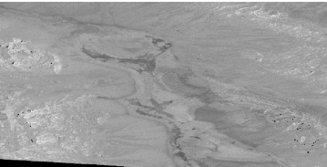
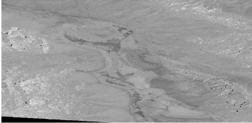

# CEOS-ARD - Synthetic Aperture Radar - Geocoded Single-Look Complex

&nbsp;

> CEOS Analysis Ready Data (CEOS-ARD) are satellite data that have been processed to a minimum set of requirements and organized into a form that allows immediate analysis with a minimum of additional user effort and interoperability both through time and with other datasets.

&nbsp;

<!-- edit:pfs/SAR-GSLC/document.yaml -->
**Product Family Specification:**
Synthetic Aperture Radar, Geocoded Single-Look Complex (SAR-GSLC)

**Version:**
1.2-draft

**Applies to:**
This PFS is specifically aimed at users interested in exploring the potential of SAR but who may lack the expertise or facilities for SAR processing.

The CEOS-ARD Geocoded Single-Look Complex (GSLC) product is relevant to interferometric studies.
The GSLC product is derived from the range-Doppler (i.e. slant range) Single-Look Complex (SLC) product using a DEM and the orbital state vectors and output in the map projected system.
The phase of a geocoded SLC is “flattened” with respect to a reference orbit and to a DEM, to eliminate topographic phase contributions [@zebker2017; @zheng2017].
The sample spacing of the GSLC product in the map coordinate directions is comparable to the full resolution original SLC product.
The GSLC product can be directly overlaid on a map or combined with other similar GSLC products to derive interferograms and create change maps, for example.
Since the GSLC phase is flattened, the phase difference between two GSLC products acquired on a same relative orbit produces an interferogram referring only to surface displacement and noise (i.e., no topographic fringes).
The GSLC product may optionally be radiometrically terrain corrected such that the squared amplitude yields $\gamma^0_T$.

&#12;

## Document History

Not available yet

## Contributing Authors
<!-- edit:pfs/SAR-GSLC/authors.yaml -->

- Alaska Satellite Facility, USA
  - Franz Meyer
  - Thomas Logan
- Collecte Localisation Satellites, France
  - Guillaume Hajduch
- CONAE, Argentina
  - Danilo Dadamia
- CSIRO, Australia
  - Zheng-Shu Zhou
- Digital Earth Africa, Australia
  - Fang Yuan
- Earth Big Data, USA
  - Josef Kellndorfer
- Environment and Climate Change, Canada
  - Benjamin Deschamps
- European Space Agency (ESA), Italy
  - Clément Albinet
  - Muriel Pinheiro
  - Nuno Miranda
- Geoscience Australia, Australia
  - Adam Lewis
  - Andreia Siqueira
  - Medhavy Thankappan
- German Aerospace Centre (DLR), Germany
  - Anna Wendleder
  - John Truckenbrodt
- ISRO, India
  - HariPriya Sakethapuram
- Japan Aerospace Exploration Agency, Japan
  - Takeo Tadono
- Jet Propulsion Laboratory, USA
  - Bruce Chapman
  - Gustavo Shiroma
  - Marco Lavalle
  - Virginia Brancato
- Natural Resources Canada, Canada
  - François Charbonneau
- RHEA, Italy
  - Antonio Valentino
- Sinergise, Slovenia
  - Marko Repse
- soloEO, Japan
  - Ake Rosenqvist
- Stanford University, USA
  - Howard Zebker
- University of Zurich, Switzerland
  - David Small

&#12;

## Glossary

ALE
:   Absolute geolocation error

ATBD
:   Algorithm Theoretical Basis Document

Auxiliary Data
:   The data required for instrument processing, which does not originate in the instrument itself or from the satellite. Some auxiliary data will be generated in the ground segment, whilst other data will be provided from external sources, e.g., DEM, aerosols.

CEOS-ARD
:   Committee on Earth Observation Satellites - Analysis Ready Data

CRS
:   Coordinate Reference System

DEM
:   Digital Elevation Model

DOI
:   Digital Object Identifier

DSM
:   Digital Surface Model

ECEF
:   Earth-Centred Earth-Fixed

ECR
:   Earth-Centred Rotating

EGM
:   Earth Gravitational Model

ENL
:   Equivalent Number of Looks

EPSG Code
:   An EPSG code is a unique identifier assigned to e.g. a specific coordinate reference system (CRS) by the European Petroleum Survey Group (EPSG).

GSLC
:   Geocoded Single-Look Complex

InSAR
:   Interferometric Radar

ISLR
:   Intensity Signal-to-Noise Level Ratio

LUT
:   Look-Up Table

NRB
:   Normalised Radar Backscatter

ORB
:   Ocean Radar Backscatter

POL
:   Polarimetric Radar

PSLR
:   Polarimetric Signal-to-Noise Level Ratio

RTC
:   Radiometrically Terrain Corrected

SAR
:   Synthetic Aperture Radar

SI
:   International System of Units, internationally known by the abbreviation SI (from French Système international d'unités)

SLC
:   Single-Look Complex

STAC
:   SpatioTemporal Asset Catalog

UPS
:   Universal Polar Stereographic

URL
:   Uniform Resource Locator, a reference to a web resource that specifies its location on a computer network and a mechanism for retrieving it.

UTC
:   Coordinated Universal Time

UTM
:   Universal Transverse Mercator

WGS84
:   World Geodetic System 1984

WKT
:   Well-Known Text (WKT) is a text markup language for representing vector geometry objects on a map, spatial reference systems of spatial objects, and transformations between spatial reference systems.
The formats were originally defined by the Open Geospatial Consortium (OGC) and described in their Simple Feature Access and Coordinate Transformation Service specifications.

&#12;

## Introduction

### What are CEOS Analysis Ready Data (CEOS-ARD) products? {#sec:intro-what-are-ceos-ard-products label="|What are CEOS Analysis Ready Data (CEOS-ARD) products?"}
<!-- edit:sections/introduction/what-are-ceos-ard-products.yaml-->

CEOS-ARD products have been processed to a minimum set of requirements and organized into a form that allows immediate analysis with a minimum of additional user effort.
These products would be resampled onto a common geometric grid (for a given product) and would provide baseline data for further interoperability both through time and with other datasets.

CEOS-ARD are intended to be flexible and accessible products suitable for a wide range of users for a wide variety of applications, particularly time series analysis and multi-sensor application development.
They are also intended to support rapid ingestion and exploitation via high-performance computing, cloud computing and other future data architectures.
They may not be suitable for all purposes and are not intended as a _replacement_ for other types of satellite products.

### When can a product be called CEOS-ARD? {#sec:intro-when-is-a-product-ceos-ard label="|When can a product be called CEOS-ARD?"}
<!-- edit:sections/introduction/when-is-a-product-ceos-ard.yaml-->

The CEOS-ARD branding is applied to a particular product once:

- that product has been assessed as meeting CEOS-ARD requirements by the agency or other entities responsible for production and distribution of the product, and
- that the assessment has been peer reviewed by the relevant CEOS team(s).

Agencies or other entities considering undertaking an assessment process should consult the [CEOS-ARD Governance Framework](https://ceos.org/ard/files/CEOS_ARD_Governance_Framework_18-October-2021.pdf) or contact <ard-contact@lists.ceos.org>.

A product can continue to use CEOS-ARD branding as long as its generation and distribution remain consistent with the peer-reviewed assessment.

### What is the difference between Threshold and Goal? {#sec:intro-difference-threshold-goal label="|What is the difference between Threshold and Goal?"}
<!-- edit:sections/introduction/difference-threshold-goal.yaml-->

**Threshold** (or: minimum) requirements are the **minimum** that is needed for the data to be analysis ready.
This must be practical and accepted by the data producers.

**Goal** (or: desired) requirements (previously referred to as “Target”) are the ideal; where we would like to be.
Some providers may already meet these.

Products that meet all _threshold_ requirements should be immediately useful for scientific analysis or decision-making.

Products that meet _goal_ requirements will reduce the overall product uncertainties and enhance broad-scale applications.
For example, the products may enhance interoperability or provide increased accuracy through additional corrections that are not reasonable at the _threshold_ level.

Goal requirements anticipate continuous improvement of methods and evolution of community expectations, which are both normal and inevitable in a developing field.
Over time, _goal_ specifications may (and subject to due process) become accepted as _threshold_ requirements.

&#12;

## Requirements
<!-- edit:pfs/SAR-GSLC/requirements.yaml -->

**WARNING:** The requirement numbers below are not stable and may change or may be removed at any time.
Do **not** use the numbers to refer back to specific requirements!
Instead, use the textual identifier that is provided in brackets directly after the title.

<!-- todo: remove requirement numbers -->

### `1.` General Metadata {#sec:meta label="|General Metadata"}
<!-- edit:sections/requirement-categories/general-metadata.yaml-->

These are metadata records describing a distributed collection of pixels.
The collection of pixels referred to must be contiguous in space and time.
General metadata should allow the user to assess the _overall_ suitability of the dataset, and must meet the requirements listed below.

#### `1.1.` General Metadata: Traceability {#sec:meta.metadata-traceability-sar label="|General Metadata: Traceability"}
<!-- edit:requirements/metadata/traceability-sar.yaml-->

Identifier: `meta.metadata-traceability-sar`

##### Threshold requirements:

*None*

##### Goal requirements:

Data must be traceable to SI reference standard.

Notes:

1. Relationship to [@sec:rcm.metadata-radiometric-accuracy]. Traceability requires an estimate of measurement uncertainty.
2. Information on traceability should be available in the metadata as a single DOI landing page.

---

#### `1.2.` General Metadata: Metadata Machine Readability {#sec:meta.metadata-machine-readability label="|General Metadata: Metadata Machine Readability"}
<!-- edit:requirements/metadata/machine-readability.yaml-->

Identifier: `meta.metadata-machine-readability`

##### Threshold requirements:

Metadata is provided in a structure that enables a computer algorithm to be used consistently and to automatically identify and extract each component part for further use.

##### Goal requirements:

Metadata is formatted in accordance with CEOS-ARD SAR Metadata Specifications, v.1.1, or in a community endorsed standard that facilitates machine-readability, such as ISO 19115-2, Climate and Forecast (CF) convention, the Attribute Convention for Data Discovery (ACDD), etc.

---

#### `1.3.` General Metadata: Product Type {#sec:meta.metadata-product-type-sar label="|General Metadata: Product Type"}
<!-- edit:requirements/metadata/product-type-sar.yaml-->

Identifier: `meta.metadata-product-type-sar`

##### Threshold requirements:

CEOS-ARD product type name – or names in case of compliance with more than one product type – and, if required by the data provider, copyright.

##### Goal requirements:

*None*

---

#### `1.4.` General Metadata: Document Identifier {#sec:meta.metadata-pfs-url label="|General Metadata: Document Identifier"}
<!-- edit:requirements/metadata/pfs-url.yaml-->

Identifier: `meta.metadata-pfs-url`

##### Threshold requirements:

Reference to CEOS-ARD PFS document as URL.

##### Goal requirements:

*None*

---

#### `1.5.` General Metadata: Data Collection Time {#sec:meta.metadata-time label="|General Metadata: Data Collection Time"}
<!-- edit:requirements/metadata/time.yaml-->

Identifier: `meta.metadata-time`

##### Threshold requirements:

Number of source data acquisitions of the data collection is identified.
The start and stop UTC time of data collection is identified in the metadata, expressed in date/time.
In case of composite products, the dates/times of the first and last data takes and the per-pixel metadata [@sec:pxl.per-pixel-acquisition-id] is provided with the product.

##### Goal requirements:

*None*

### `2.` Source Metadata {#sec:src label="|Source Metadata"}
<!-- edit:sections/requirement-categories/source-metadata.yaml-->

These are metadata records describing (detailing) **each** acquisition (source data) used to generate the ARD product.
This may be one or mutliple acquisitions.

#### `2.1.` Source Metadata: Sequential ID {#sec:src.metadata-sequential-id label="|Source Metadata: Sequential ID"}
<!-- edit:requirements/metadata/sequential-id.yaml-->

Identifier: `src.metadata-sequential-id`

##### Threshold requirements:

Each acquisition is identified through a sequential identifier in the metadata, e.g. 1, 2, 3.

##### Goal requirements:

*None*

---

#### `2.2.` Source Metadata: Source Data Access {#sec:src.metadata-data-access-source label="|Source Metadata: Source Data Access"}
<!-- edit:requirements/metadata/data-access-source.yaml-->

Identifier: `src.metadata-data-access-source`

##### Threshold requirements:

The metadata identifies the location from where the source data can be retrieved, expressed as a URL or DOI.

##### Goal requirements:

The metadata identifies an online location from where the data can be consistently and reliably retrieved by a computer algorithm without any manual intervention being required.

---

#### `2.3.` Source Metadata: Instrument {#sec:src.metadata-instrument label="|Source Metadata: Instrument"}
<!-- edit:requirements/metadata/instrument.yaml-->

Identifier: `src.metadata-instrument`

##### Threshold requirements:

The instrument used to collect the data is identified in the metadata:

- Satellite name
- Instrument name

##### Goal requirements:

A reference to the relevant [CEOS Missions, Instruments and Measurements Database](https://ceos.org/mim-database/) record.

---

#### `2.4.` Source Metadata: Source Data Acquisition Time {#sec:src.metadata-time-source label="|Source Metadata: Source Data Acquisition Time"}
<!-- edit:requirements/metadata/time-source.yaml-->

Identifier: `src.metadata-time-source`

##### Threshold requirements:

The start date and time of source data is identified in the metadata, expressed in UTC in date and time, at least to the second.

##### Goal requirements:

*None*

---

#### `2.5.` Source Metadata: Source Data Acquisition Parameters {#sec:src.metadata-acquisition-parameters-sar label="|Source Metadata: Source Data Acquisition Parameters"}
<!-- edit:requirements/metadata/acquisition-parameters-sar.yaml-->

Identifier: `src.metadata-acquisition-parameters-sar`

##### Threshold requirements:

Acquisition parameters related to the SAR antenna:

- Radar band
- Centre frequency
- Observation mode (i.e., beam mode name)
- Polarization(s) (listed as in original product)
- Antenna pointing (right/left)
- Beam ID (i.e., beam mode mnemonic)

##### Goal requirements:

*None*

---

#### `2.6.` Source Metadata: Orbit Information {#sec:src.metadata-orbit label="|Source Metadata: Orbit Information"}
<!-- edit:requirements/metadata/orbit.yaml-->

Identifier: `src.metadata-orbit`

##### Threshold requirements:

Information related to the platform orbit used for data processing:

- Pass direction (asc/desc)[^orbit-pass-direction]
- Orbit data source (e.g., predicted, definite, precise, downlinked, etc.)

[^orbit-pass-direction]: For data crossing the North or South Pole, it is recommended to produce two distinct products and to use the appropriate “Pass direction” in each.

##### Goal requirements:

- Platform heading angle expressed in degrees (0-360) from North 
- Orbit data file containing state vectors (minimum of 5 state vectors, from 10% of scene length before start time to 10% of scene length after stop time) 
- Platform (mean) altitude

---

#### `2.7.` Source Metadata: Processing Parameters {#sec:src.metadata-processing-parameters label="|Source Metadata: Processing Parameters"}
<!-- edit:requirements/metadata/processing-parameters.yaml-->

Identifier: `src.metadata-processing-parameters`

##### Threshold requirements:

Processing parameters details of the data:

- Processing facility
- Processing date
- Software version
- Product level
- Product ID (file name)
- Azimuth number of looks
- Range number of looks (separate values for each beam, as necessary)

##### Goal requirements:

Additional relevant processing parameters, e.g., range- and azimuth look bandwidth and LUT applied.

---

#### `2.8.` Source Metadata: Source Data Image Attributes {#sec:src.metadata-image-attributes-sar label="|Source Metadata: Source Data Image Attributes"}
<!-- edit:requirements/metadata/image-attributes-sar.yaml-->

Identifier: `src.metadata-image-attributes-sar`

##### Threshold requirements:

Image attributes related to the source data:

- Source Data geometry (slant range/ground range)
- Azimuth pixel spacing \[m] (alternatively, Azimuth pixel spacing can be provided in second \[s], equivalent to the azimuth time sample interval) 
- Range pixel spacing 
- Azimuth resolution 
- Range resolution 
- Near range incident angle 
- Far range incident angle

##### Goal requirements:

Geometry of the image footprint expressed in WGS84 in a standardised format (e.g., WKT).

---

#### `2.9.` Source Metadata: Sensor Calibration {#sec:src.metadata-sensor-calibration label="|Source Metadata: Sensor Calibration"}
<!-- edit:requirements/metadata/sensor-calibration.yaml-->

Identifier: `src.metadata-sensor-calibration`

##### Threshold requirements:

*None*

##### Goal requirements:

Sensor calibration parameters are identified in the metadata or can be accessed using details included in the metadata.
Ideally this would support machine-to-machine access.

---

#### `2.10.` Source Metadata: Performance Indicators {#sec:src.metadata-performance-indicators label="|Source Metadata: Performance Indicators"}
<!-- edit:requirements/metadata/performance-indicators.yaml-->

Identifier: `src.metadata-performance-indicators`

##### Threshold requirements:

Provide performance indicators on data intensity noise level ($\text{NE}\sigma^0$ and/or $\text{NE}\beta^0$ and/or $\text{NE}\gamma^0$, i.e., noise equivalent Sigma- and/or Beta- and/or Gamma-Nought).
Provided for each polarization channel when available.
Parameter may be expressed as the mean and/or minimum and maximum noise equivalent values of the data. 
Values do not need to be estimated individually for each product, but may be estimated once for each acquisition mode, and annotated on all products.

##### Goal requirements:

Provide additional relevant performance indicators (e.g., ENL, PSLR, ISLR, and performance reference DOI or URL).

---

#### `2.11.` Source Metadata: Polarimetric Calibration Matrices {#sec:src.metadata-polarimetric-calibration-matrices label="|Source Metadata: Polarimetric Calibration Matrices"}
<!-- edit:requirements/metadata/polarimetric-calibration-matrices.yaml-->

Identifier: `src.metadata-polarimetric-calibration-matrices`

##### Threshold requirements:

*None*

##### Goal requirements:

The complex-valued polarimetric distortion matrices with the channel imbalance and the cross-talk applied for the polarimetric calibration.

---

#### `2.12.` Source Metadata: Mean Faraday Rotation Angle {#sec:src.metadata-mean-faraday-rotation-angle label="|Source Metadata: Mean Faraday Rotation Angle"}
<!-- edit:requirements/metadata/mean-faraday-rotation-angle.yaml-->

Identifier: `src.metadata-mean-faraday-rotation-angle`

##### Threshold requirements:

*None*

##### Goal requirements:

The mean Faraday rotation angle estimated from the polarimetric data and/or from models with reference to the method or paper used to derive the estimate.

---

#### `2.13.` Source Metadata: Ionosphere Indicator {#sec:src.metadata-ionosphere-indicator label="|Source Metadata: Ionosphere Indicator"}
<!-- edit:requirements/metadata/ionosphere-indicator.yaml-->

Identifier: `src.metadata-ionosphere-indicator`

##### Threshold requirements:

*None*

##### Goal requirements:

Flag indicating whether the backscatter imagery is “significantly impacted” by the ionosphere (0 – false, 1 – true).
Significant impact would imply that the ionospheric impact on the backscatter exceeds the radiometric calibration requirement or goal for the imagery.

### `3.` Product Metadata {#sec:prd label="|Product Metadata"}
<!-- edit:sections/requirement-categories/product-metadata.yaml-->

Information related to the CEOS-ARD product generation procedure and geographic parameters.

#### `3.1.` Product Metadata: Product Data Access {#sec:prd.metadata-data-access-product label="|Product Metadata: Product Data Access"}
<!-- edit:requirements/metadata/data-access-product.yaml-->

Identifier: `prd.metadata-data-access-product`

##### Threshold requirements:

Processing parameters details of the CEOS-ARD product:

- Processing facility
- Processing date
- Software version
- Location from where CEOS-ARD product can be retrieved, expressed as a URL or DOI.

##### Goal requirements:

The metadata identifies an online location from where the data can be consistently and reliably retrieved by a computer algorithm without any manual intervention being required.

---

#### `3.2.` Product Metadata: Auxiliary Data {#sec:prd.metadata-auxiliary-data label="|Product Metadata: Auxiliary Data"}
<!-- edit:requirements/metadata/auxiliary-data.yaml-->

Identifier: `prd.metadata-auxiliary-data`

##### Threshold requirements:

*None*

##### Goal requirements:

The metadata identifies the sources of auxiliary data used in the generation process, ideally expressed as DOIs.

Notes:

1. Auxiliary data includes DEMs, etc., and any additional data sources used in the generation of the product.

---

#### `3.3.` Product Metadata: Sample Spacing {#sec:prd.metadata-sample-spacing label="|Product Metadata: Sample Spacing"}
<!-- edit:requirements/metadata/sample-spacing.yaml-->

Identifier: `prd.metadata-sample-spacing`

##### Threshold requirements:

Product processing parameters details:

- Pixel (column) spacing
- Line (row) spacing

##### Goal requirements:

*None*

---

#### `3.4.` Product Metadata: Resolution {#sec:prd.metadata-resolution label="|Product Metadata: Resolution"}
<!-- edit:requirements/metadata/resolution.yaml-->

Identifier: `prd.metadata-resolution`

##### Threshold requirements:

*None*

##### Goal requirements:

Average spatial resolution along:

- Columns
- Rows

---

#### `3.5.` Product Metadata: Bounding Box {#sec:prd.metadata-bounding-box label="|Product Metadata: Bounding Box"}
<!-- edit:requirements/metadata/bounding-box.yaml-->

Identifier: `prd.metadata-bounding-box`

##### Threshold requirements:

Two opposite corners of the measurement file (bounding box, including any zero-fill values) are identified,
expressed in the coordinate reference system defined in [@sec:prd.metadata-crs].

Notes:

1. Four corners of the measurement file are recommended for scenes crossing the Antemeridian, or the North or the South Pole.

##### Goal requirements:

*None*

---

#### `3.6.` Product Metadata: Geographical Extent {#sec:prd.metadata-footprint label="|Product Metadata: Geographical Extent"}
<!-- edit:requirements/metadata/footprint.yaml-->

Identifier: `prd.metadata-footprint`

##### Threshold requirements:

The geometry of the image footprint expressed in WGS84, in a standardised format (e.g., WKT Polygon).

##### Goal requirements:

*None*

---

#### `3.7.` Product Metadata: Image Size {#sec:prd.metadata-image-size label="|Product Metadata: Image Size"}
<!-- edit:requirements/metadata/image-size.yaml-->

Identifier: `prd.metadata-image-size`

##### Threshold requirements:

Image attributes:

- Number of lines
- Number of pixels per line
- File header size (if applicable)
- Number of no-data border pixels (if applicable)

##### Goal requirements:

*None*

---

#### `3.8.` Product Metadata: Pixel Coordinate Convention {#sec:prd.metadata-pixel-coordinate-convention label="|Product Metadata: Pixel Coordinate Convention"}
<!-- edit:requirements/metadata/pixel-coordinate-convention.yaml-->

Identifier: `prd.metadata-pixel-coordinate-convention`

##### Threshold requirements:

Coordinate referring to the centre, the upper left corner, or the lower left corner of a pixel.
Values are [pixel centre, pixel ULC or pixel LLC].

##### Goal requirements:

*None*

---

#### `3.9.` Product Metadata: Coordinate Reference System {#sec:prd.metadata-crs label="|Product Metadata: Coordinate Reference System"}
<!-- edit:requirements/metadata/crs.yaml-->

Identifier: `prd.metadata-crs`

##### Threshold requirements:

The metadata lists the map projection (or geographical coordinates, if applicable) that was used and any relevant parameters required to geolocate data in that map projection, expressed in a standardised format (e.g., WKT).  
Indicate EPSG code, if defined for the CRS.

##### Goal requirements:

*None*

---

#### `3.10.` Product Metadata: Radar Unit Look Vector {#sec:prd.metadata-radar-unit-look-vector label="|Product Metadata: Radar Unit Look Vector"}
<!-- edit:requirements/metadata/radar-unit-look-vector.yaml-->

Identifier: `prd.metadata-radar-unit-look-vector`

##### Threshold requirements:

3-D components radar unit look vector, specified at centre of scene, in an Earth-Centred Earth-Fixed (ECEF) coordinate system (also called Earth Centred Rotating - ECR) is provided.
It consists of unit vectors from antenna to surface pixel (i.e., positive Z component).
Only required if a Radar Unit Look Vector Grid Image (see [@sec:pxl.per-pixel-radar-unit-look-vector-grid]) is **not** provided.

##### Goal requirements:

*None*

---

#### `3.11.` Product Metadata: Slant Range Sensor to Surface {#sec:prd.metadata-slant-range label="|Product Metadata: Slant Range Sensor to Surface"}
<!-- edit:requirements/metadata/slant-range.yaml-->

Identifier: `prd.metadata-slant-range`

##### Threshold requirements:

Slant range distance from the sensor to the surface, specified at centre of scene. 
Only required if a Slant Range Sensor to Surface Image (see [@sec:pxl.per-pixel-slant-range]) is **not** provided.

##### Goal requirements:

*None*

---

#### `3.12.` Product Metadata: Reference Orbit {#sec:prd.metadata-orbit-reference-gslc label="|Product Metadata: Reference Orbit"}
<!-- edit:requirements/metadata/orbit-reference-gslc.yaml-->

Identifier: `prd.metadata-orbit-reference-gslc`

**Usage: When a reference orbit is used instead of a virtual orbit (see [@sec:annex-sar-topographic-phase-removal]).**

##### Threshold requirements:

*None*

##### Goal requirements:

Provide the absolute orbit number used as reference for topographic phase flattening.
In case a virtual orbit has been used, provide orbit parameters or orbit state vectors as DOI or URL.

Provide scene-centred perpendicular baseline for the for the source data relative to the reference orbit used (for approximate use only).

### `4.` Per-Pixel Metadata {#sec:pxl label="|Per-Pixel Metadata"}
<!-- edit:sections/requirement-categories/per-pixel-metadata.yaml-->

The following minimum metadata specifications apply to each pixel.
Whether the metadata are provided in a single record relevant to all pixels or separately for each pixel is at the discretion of the data provider.
Per-pixel metadata should allow users to discriminate between (choose) observations on the basis of their individual suitability for applications.

#### `4.1.` Per-Pixel Metadata: Cloud Optimized Formats {#sec:pxl.cloud-optimized-formats label="|Per-Pixel Metadata: Cloud Optimized Formats"}
<!-- edit:requirements/cloud-optimized-formats.yaml-->

Identifier: `pxl.cloud-optimized-formats`

##### Threshold requirements:

*None*

##### Goal requirements:

All files are provided using cloud-optimized file formats.

---

#### `4.2.` Per-Pixel Metadata: Metadata Machine Readability {#sec:pxl.metadata-machine-readability label="|Per-Pixel Metadata: Metadata Machine Readability"}
<!-- edit:requirements/metadata/machine-readability.yaml-->

Identifier: `pxl.metadata-machine-readability`

##### Threshold requirements:

Metadata is provided in a structure that enables a computer algorithm to be used consistently and to automatically identify and extract each component part for further use.

##### Goal requirements:

Metadata is formatted in accordance with CEOS-ARD SAR Metadata Specifications, v.1.1, or in a community endorsed standard that facilitates machine-readability, such as ISO 19115-2, Climate and Forecast (CF) convention, the Attribute Convention for Data Discovery (ACDD), etc.

---

#### `4.3.` Per-Pixel Metadata: Data Mask Image {#sec:pxl.per-pixel-data-mask label="|Per-Pixel Metadata: Data Mask Image"}
<!-- edit:requirements/per-pixel/data-mask.yaml-->

Identifier: `pxl.per-pixel-data-mask`

##### Threshold requirements:

Mask image indicating:

- Valid data
- Invalid data
- No data

File format specifications/contents provided in metadata:

- Sample Type (Mask)
- Data Format (GeoTIFF, HDF5, NetCDF, …)
- Data Type (Int, Float, …)
- Bits per Sample
- Byte Order
- Bit Value Representation

##### Goal requirements:

Additional bit value representations, e.g.:

- Layover (masked as invalid data in threshold)
- Radar shadow (masked as invalid data in threshold)
- Ocean water
- Land (recommended for ORB)
- RTC applied (e.g., for maritime scenes with land samples for which RTC has been applied)
- DEM gap filling (i.e., interpolated DEM over gaps)

---

#### `4.4.` Per-Pixel Metadata: Scattering Area Image {#sec:pxl.per-pixel-scattering-area label="|Per-Pixel Metadata: Scattering Area Image"}
<!-- edit:requirements/per-pixel/scattering-area.yaml-->

Identifier: `pxl.per-pixel-scattering-area`

**Usage: Recommended for scenes that include land areas.**

##### Threshold requirements:

*None*

##### Goal requirements:

DEM-based scattering area image used for Gamma-Nought terrain normalisation is provided.
This quantifies the local scattering area used to normalise for radiometric distortions induced by terrain to the measured $\beta^0$ backscatter.
The terrain-flattened $\gamma^0_T$ is best understood as $\beta^0$ divided by the local scattering area.

File format specifications/contents provided in metadata:
- Sample Type (Scattering Area)
- Data Format (GeoTIFF, HDF5, NetCDF, …)
- Data Type (Int, Float, …)
- Bits per Sample
- Byte Order

---

#### `4.5.` Per-Pixel Metadata: Local Incident Angle Image {#sec:pxl.per-pixel-local-incident-angle label="|Per-Pixel Metadata: Local Incident Angle Image"}
<!-- edit:requirements/per-pixel/local-incident-angle.yaml-->

Identifier: `pxl.per-pixel-local-incident-angle`

##### Threshold requirements:

DEM-based Local Incident angle image is provided.

File format specifications/contents provided in metadata:

- Sample Type (Angle)
- Data Format (GeoTIFF, HDF5, NetCDF, …)
- Data Type (Int, Float, …)
- Bits per Sample
- Byte Order

Notes:

1. For maritime ORB scenes when no land areas are covered, a geoid model could be used for the calculation of the local incident angle

##### Goal requirements:

*None*

---

#### `4.6.` Per-Pixel Metadata: Ellipsoidal Incident Angle Image {#sec:pxl.per-pixel-ellipsoidal-incident-angle label="|Per-Pixel Metadata: Ellipsoidal Incident Angle Image"}
<!-- edit:requirements/per-pixel/ellipsoidal-incident-angle.yaml-->

Identifier: `pxl.per-pixel-ellipsoidal-incident-angle`

##### Threshold requirements:

Ellipsoidal incident angle is provided.

File format specifications/contents provided in metadata:

- Sample Type (Angle)
- Data Format (GeoTIFF, HDF5, NetCDF, …)
- Data Type (Int, Float, …)
- Bits per Sample
- Byte Order
- Reference Ellipsoid Name

Notes:

1. For maritime ORB scenes when no land areas are covered, a geoid model could be used for the calculation of the local incident angle

##### Goal requirements:

*None*

---

#### `4.7.` Per-Pixel Metadata: Noise Power Image {#sec:pxl.per-pixel-noise-power label="|Per-Pixel Metadata: Noise Power Image"}
<!-- edit:requirements/per-pixel/noise-power.yaml-->

Identifier: `pxl.per-pixel-noise-power`

##### Threshold requirements:

*None*

##### Goal requirements:

Estimated Noise Equivalent $\sigma^0$ (or $\beta^0$ or $\gamma^0$, as applicable) used for noise removal, if applied, for each channel.
$\text{NE}\sigma^0$ and $\text{NE}\gamma^0$ are both based on a simplified ellipsoid Earth model.

File format specifications/contents provided in metadata:

- Sample Type (Gamma-Nought, Sigma-Nought, Beta-Nought)
- Data Format (GeoTIFF, HDF5, NetCDF, …)
- Data Type (Int, Float, …)
- Bits per Sample
- Byte Order

---

#### `4.8.` Per-Pixel Metadata: Gamma-to-Sigma Ratio Image {#sec:pxl.per-pixel-gamma-sigma-ratio label="|Per-Pixel Metadata: Gamma-to-Sigma Ratio Image"}
<!-- edit:requirements/per-pixel/gamma-sigma-ratio.yaml-->

Identifier: `pxl.per-pixel-gamma-sigma-ratio`

##### Threshold requirements:

*None*

##### Goal requirements:

Ratio of the integrated area in the Gamma projection over the integrated area 
in the Sigma projection (ground). Multiplying RTC $\gamma^0_T$ by this ratio results in an 
estimate of RTC $\sigma^0_T$.

File format specifications/contents provided in metadata:

- Sample Type (Ratio)
- Data Format (GeoTIFF, HDF5, NetCDF, …)
- Data Type (Int, Float, …)
- Bits per Sample
- Byte Order

---

#### `4.9.` Per-Pixel Metadata: Acquisition ID Image {#sec:pxl.per-pixel-acquisition-id label="|Per-Pixel Metadata: Acquisition ID Image"}
<!-- edit:requirements/per-pixel/acquisition-id.yaml-->

Identifier: `pxl.per-pixel-acquisition-id`

##### Threshold requirements:

**Required for multi-source product only.**

Acquisition ID, or acquisition date, for each pixel is identified.

In case of multi-temporal image stacks, use source acquisition ID (i.e., [@sec:src.metadata-sequential-id]) to list contributing images.

In case of date, data represent (integer or fractional) day offset to reference observation date (in UTC). Date used as reference (“Day 0”) is provided in the metadata.

Pixels not representing a unique date (e.g., pixels averaged in image overlap zones) are flagged with a pre-set pixel value that is provided in the metadata.

File format specifications/contents provided in metadata:

- Sample type (Day, Time, ID)
- Data Format (GeoTIFF, HDF5, NetCDF, …)
- Data Type (Int, Float, …)
- Bits per sample
- Byte Order

##### Goal requirements:

In case of image composites, the sources for each pixel are uniquely identified.

---

#### `4.10.` Per-Pixel Metadata: DEM {#sec:pxl.per-pixel-dem label="|Per-Pixel Metadata: DEM"}
<!-- edit:requirements/per-pixel/dem.yaml-->

Identifier: `pxl.per-pixel-dem`

##### Threshold requirements:

*None*

##### Goal requirements:

Provide DEM or DSM as used during the geometric and radiometric processing of the SAR data, resampled to an exact geometric match in extent and resolution with the image product.

Can also be provided with ORB products containing land areas.

File format specifications/contents provided in metadata:

- Sample Type (Height)
- Data Format (GeoTIFF, HDF5, NetCDF, …)
- Data Type (Int, Float, …)
- Bits per Sample
- Byte Order

---

#### `4.11.` Per-Pixel Metadata: Radar Unit Look Vector Grid Image {#sec:pxl.per-pixel-radar-unit-look-vector-grid label="|Per-Pixel Metadata: Radar Unit Look Vector Grid Image"}
<!-- edit:requirements/per-pixel/radar-unit-look-vector-grid.yaml-->

Identifier: `pxl.per-pixel-radar-unit-look-vector-grid`

##### Threshold requirements:

*None*

##### Goal requirements:

3-D components radar unit look vector, specified at each pixel in an Earth-Centred Earth-Fixed (ECEF) coordinate system (also called Earth Centred Rotating – ECR) is provided.
It consists of unit vectors from the antenna to the surface pixel (i.e., positive Z component).

File format specifications/contents provided in metadata:

- Sample Type (3D unit vector)
- Data Format (GeoTIFF, HDF5, NetCDF, …)
- Data Type (Int, Float, …)
- Bits per Sample
- Byte Order

---

#### `4.12.` Per-Pixel Metadata: Slant Range Sensor to Surface Image {#sec:pxl.per-pixel-slant-range label="|Per-Pixel Metadata: Slant Range Sensor to Surface Image"}
<!-- edit:requirements/per-pixel/slant-range.yaml-->

Identifier: `pxl.per-pixel-slant-range`

##### Threshold requirements:

*None*

##### Goal requirements:

Slant range distance from the sensor to the surface, specified at each pixel in an Earth-Centred Earth-Fixed (ECEF) coordinate system (also called Earth Centred Rotating – ECR) is provided.

File format specifications/contents provided in metadata:

- Sample Type (Distance)
- Data Format (GeoTIFF, HDF5, NetCDF, …)
- Data Type (Int, Float, …)
- Bits per Sample
- Byte Order

---

#### `4.13.` Per-Pixel Metadata: InSAR Phase Uncertainty Image {#sec:pxl.per-pixel-insar-phase-uncertainty label="|Per-Pixel Metadata: InSAR Phase Uncertainty Image"}
<!-- edit:requirements/per-pixel/insar-phase-uncertainty.yaml-->

Identifier: `pxl.per-pixel-insar-phase-uncertainty`

##### Threshold requirements:

*None*

##### Goal requirements:

Estimate of uncertainty in InSAR phase is provided, such as finite signal to noise ratio, quantization noise, or DEM error.
Identification of which error sources are included will be provided as DOI/URL reference or brief description.
It represents statistical variation from known noise sources only.

File format specifications/contents provided in metadata:

- Sample Type (Angle)
- Data Format (GeoTIFF, HDF5, NetCDF, …)
- Data Type (Int, Float, …)
- Bits per Sample
- Byte Order

---

#### `4.14.` Per-Pixel Metadata: Atmospheric Phase Correction Image {#sec:pxl.per-pixel-atmospheric-phase-correction label="|Per-Pixel Metadata: Atmospheric Phase Correction Image"}
<!-- edit:requirements/per-pixel/atmospheric-phase-correction.yaml-->

Identifier: `pxl.per-pixel-atmospheric-phase-correction`

##### Threshold requirements:

*None*

##### Goal requirements:

Phase correction value at each pixel, if applied.
DOI/URL reference to algorithm or brief description is provided.

File format specifications/contents provided in metadata:

- Sample Type (Angle)
- Data Format (GeoTIFF, HDF5, NetCDF, …)
- Data Type (Int, Float, …)
- Bits per Sample
- Byte Order

---

#### `4.15.` Per-Pixel Metadata: Ionospheric Phase Correction Image {#sec:pxl.per-pixel-ionospheric-phase-correction label="|Per-Pixel Metadata: Ionospheric Phase Correction Image"}
<!-- edit:requirements/per-pixel/ionospheric-phase-correction.yaml-->

Identifier: `pxl.per-pixel-ionospheric-phase-correction`

##### Threshold requirements:

*None*

##### Goal requirements:

Phase correction value at each pixel, if applied.
DOI/URL reference to algorithm or brief description is provided.

File format specifications/contents provided in metadata:

- Sample Type (Angle)
- Data Format (GeoTIFF, HDF5, NetCDF, …)
- Data Type (Int, Float, …)
- Bits per Sample
- Byte Order

### `5.` Radiometrically Corrected Measurements {#sec:rcm label="|Radiometrically Corrected Measurements"}
<!-- edit:sections/requirement-categories/radiometrically-corrected-measurements.yaml-->

The requirements indicate the necessary outcomes and, to some degree, the minimum steps necessary to be deemed to have achieved those outcomes.
Radiometric corrections must lead to normalised measurement(s) of backscatter intensity and/or decomposed polarimetric parameters.
As for the per-pixel metadata, information regarding data format specification needs to be provided for each record.
The requirements below must be met for all pixels/samples/observations in a collection.

#### `5.1.` Radiometrically Corrected Measurements: Cloud Optimized Formats {#sec:rcm.cloud-optimized-formats label="|Radiometrically Corrected Measurements: Cloud Optimized Formats"}
<!-- edit:requirements/cloud-optimized-formats.yaml-->

Identifier: `rcm.cloud-optimized-formats`

##### Threshold requirements:

*None*

##### Goal requirements:

All files are provided using cloud-optimized file formats.

---

#### `5.2.` Radiometrically Corrected Measurements: Backscatter Measurements \[GSLC] {#sec:rcm.measurements-backscatter-gslc label="|Radiometrically Corrected Measurements: Backscatter Measurements \[GSLC]"}
<!-- edit:requirements/measurements/backscatter-gslc.yaml-->

Identifier: `rcm.measurements-backscatter-gslc`

##### Threshold requirements:

Radiometric and Phase Terrain-flattened Gamma-Nought backscatter coefficient ($\gamma^0_T$), in complex number format, is provided for each polarization (e.g., HH, HV, VV, VH).

File format specifications/contents provided in metadata:

- Measurement Type (Gamma-Nought)
- Backscatter Expression Convention (linear amplitude, linear power\*)
- Polarization (HH, HV, VV, VH)
- Data Format (GeoTIFF, HDF5, NetCDF, …)
- Data Type (Int, Float, …)
- Bits per Sample
- Byte Order

Notes:

1. Transformation to the logarithm decibel scale is not required or desired as this step can be completed by the user if necessary.

##### Goal requirements:

*None*

---

#### `5.3.` Radiometrically Corrected Measurements: Scaling Conversion {#sec:rcm.metadata-scaling-conversion label="|Radiometrically Corrected Measurements: Scaling Conversion"}
<!-- edit:requirements/metadata/scaling-conversion.yaml-->

Identifier: `rcm.metadata-scaling-conversion`

##### Threshold requirements:

If applicable, indicate the equation to convert pixel linear amplitude/power to logarithmic decibel scale, including, if applicable, the associated calibration (dB offset) factor, and/or the equation used to convert compressed data (int8/int16/float16) to float32.

##### Goal requirements:

Use of float32.

---

#### `5.4.` Radiometrically Corrected Measurements: Noise Removal {#sec:rcm.metadata-noise-removal label="|Radiometrically Corrected Measurements: Noise Removal"}
<!-- edit:requirements/metadata/noise-removal.yaml-->

Identifier: `rcm.metadata-noise-removal`

##### Threshold requirements:

Flag if noise removal has been applied (Y/N).
Metadata should include the noise removal algorithm and reference to the algorithm as URL or DOI.

Notes:

1. Thermal noise removal and image border noise removal to remove overall scene noise and scene edge artefacts, respectively.

##### Goal requirements:

*None*

---

#### `5.5.` Radiometrically Corrected Measurements: Radiometric Terrain Correction Algorithm {#sec:rcm.corrections-radiometric-terrain-correction-gslc label="|Radiometrically Corrected Measurements: Radiometric Terrain Correction Algorithm"}
<!-- edit:requirements/corrections/radiometric-terrain-correction-gslc.yaml-->

Identifier: `rcm.corrections-radiometric-terrain-correction-gslc`

##### Threshold requirements:

*None*

##### Goal requirements:

Adjustments were made for terrain by modelling the local contributing scattering area using the preferred choice of a published peer-reviewed algorithm to produce radiometrically terrain corrected (RTC) $\gamma^0_T$ backscatter estimates.  

Metadata references, e.g.

- a citable peer-reviewed algorithm
- technical documentation regarding the algorithm used to generate the backscatter estimates is expressed as URLs or DOIs 
- the sources of auxiliary data used to make corrections

Require resolution of DEM better than the output product resolution when applying terrain corrections.

Notes:

1. Examples of technical documentation include an Algorithm, Theoretical Basis Document, product user guide, etc.

---

#### `5.6.` Radiometrically Corrected Measurements: Radiometric Accuracy {#sec:rcm.metadata-radiometric-accuracy label="|Radiometrically Corrected Measurements: Radiometric Accuracy"}
<!-- edit:requirements/metadata/radiometric-accuracy.yaml-->

Identifier: `rcm.metadata-radiometric-accuracy`

##### Threshold requirements:

*None*

##### Goal requirements:

Uncertainty (e.g., bounds on $\gamma^0$ or $\sigma^0$) information is provided as document referenced as URL or DOI.
SI traceability is achieved.

### `6.` Geometric Corrections {#sec:gcor label="|Geometric Corrections"}
<!-- edit:sections/requirement-categories/geometric-corrections.yaml-->

The geometric corrections are steps that are taken to place the measurement accurately on the surface of the Earth (that is, to geolocate the measurement) allowing measurements taken through time to be compared.
This section specifies any geometric correction requirements that must be met in order for the data to be analysis ready.

#### `6.1.` Geometric Corrections: Geometric Correction Algorithm {#sec:gcor.metadata-geometric-correction-algorithm label="|Geometric Corrections: Geometric Correction Algorithm"}
<!-- edit:requirements/metadata/geometric-correction-algorithm.yaml-->

Identifier: `gcor.metadata-geometric-correction-algorithm`

##### Threshold requirements:

*None*

##### Goal requirements:

Metadata references, e.g.: 
- A metadata citable peer-reviewed algorithm
- Technical documentation regarding the implementation of that algorithm expressed as URLs or DOIs
- The sources of auxiliary data used to make corrections
- Resampling method used for geometric processing of the source data

Notes:

1. Examples of technical documentation can include e.g., an Algorithm Theoretical Basis Document (ATBD) or a product user guide.

---

#### `6.2.` Geometric Corrections: Digital Elevation Model {#sec:gcor.corrections-dem label="|Geometric Corrections: Digital Elevation Model"}
<!-- edit:requirements/corrections/dem.yaml-->

Identifier: `gcor.corrections-dem`

**Usage: For products including land areas.**

##### Threshold requirements:

- During ortho-rectification, the data provider shall use the same DEM that was used for the radiometric terrain flattening to ensure consistency of the data stack.
- Provide reference to Digital Elevation Model used for geometric terrain correction.
- Provide reference to Earth Gravitational Model (EGM) used for geometric correction.

##### Goal requirements:

- A DEM with comparable or better resolution to the resolution of the output CEOS-ARD product shall be used if available.
  Else, the upsampled DEM is identified.
- Resampling method used for preparation of the DEM.
- Method used for resampling the EGM.

---

#### `6.3.` Geometric Corrections: Geometric Accuracy {#sec:gcor.corrections-geometric-accuracy-radar label="|Geometric Corrections: Geometric Accuracy"}
<!-- edit:requirements/corrections/geometric-accuracy-radar.yaml-->

Identifier: `gcor.corrections-geometric-accuracy-radar`

##### Threshold requirements:

Accurate geolocation is a prerequisite to radar processing to correct for terrain and to enable interoperability between radar sensors.

The absolute geolocation error (ALE) for a sensor is typically assessed through analysis of Single Look Complex (SLC) imagery and measured along the slant range and azimuth directions (case A: SLC ALE).

The end-to-end “ARD” ALE of the final product could be measured directly in the final image product in the chosen map projection, i.e., in the map coordinate directions: e.g., Northing and Easting (case B: ARD ALE).

Providing accuracy estimates based on measurements following at least one scheme (A or B or both) meets the threshold requirement.

Estimates of the ALE is provided as a bias and a standard deviation, with (Case A) SLC ALE expressed in slant range and azimuth, and (Case B) ARD ALE expressed in map projection dimensions.

Notes:

1. This assessment is often made through comparison of measured corner reflector positions with their projected location in the imagery. In some cases, other mission calibration/validation results may be used.
2. The ALE is not typically assessed for every processed image, but through an ALE assessment by the data processing team characterizing all or (usually a subset) of the generated products.

##### Goal requirements:

Output product sub-sample accuracy should be less than or equal to 0.1 (slant range) pixel radial root mean square error (rRMSE). 
Provide documentation of estimates of ALE as DOI or URL.

---

#### `6.4.` Geometric Corrections: Geometric Refined Accuracy {#sec:gcor.corrections-geometric-refined-accuracy label="|Geometric Corrections: Geometric Refined Accuracy"}
<!-- edit:requirements/corrections/geometric-refined-accuracy.yaml-->

Identifier: `gcor.corrections-geometric-refined-accuracy`

##### Threshold requirements:

*None*

##### Goal requirements:

Values provided under [@sec:gcor.corrections-geometric-accuracy-radar] are provided by the SAR mission Cal/Val team.

CEOS-ARD processing steps could include method refining the geometric accuracy, such as cross-correlation of the SAR data in slant range with a SAR scene simulated from a DSM or DEM.

Methodology used (name and reference), quality flag, geometric standard deviation values should be provided.

---

#### `6.5.` Geometric Corrections: Gridding Convention {#sec:gcor.corrections-gridding-convention label="|Geometric Corrections: Gridding Convention"}
<!-- edit:requirements/corrections/gridding-convention.yaml-->

Identifier: `gcor.corrections-gridding-convention`

##### Threshold requirements:

A consistent gridding/sampling frame is used. The origin is chosen to minimise any need for subsequent resampling between multiple products (be they from the same or different providers).
This is typically accomplished via a “snap to grid” in relation to the most proximate grid tile in a global system.

Notes:

1. If a product hierarchy of resolutions exists (or is planned), the multiple resolutions should nest within each other (e.g., 12.5m, 25m, 50m, 100m, etc.), and not be disjoint.

##### Goal requirements:

Provide DOI or URL to gridding convention used.

When multiple providers share a common map projection, providers are encouraged to standardise the origins of their products among each other.

In the case of UTM/UPS coordinates, the upper left corner coordinates should be set to an integer multiple of sample intervals from a 100 km by 100 km grid tile of the Military Grid Reference System's 100k coordinates (“snap to grid”).

For products presented in geographic coordinates (latitude and longitude), the origin should be set to an integer multiple of samples in relation to the closest integer degree.

&#12;

## References

::: {#refs}
:::

&#12;

## Annexes

### General Processing Roadmap {#sec:annex-sar-general-processing-roadmap label="|General Processing Roadmap"}
<!-- edit:sections/annexes/sar-general-processing-roadmap.yaml-->

The radiometric interoperability of CEOS-ARD SAR products is ensured by a common processing chain during production. The recommended processing roadmap involves the following steps:

- Apply the best possible orbit parameters to give the most accurate product possible. These will have been projected to an ellipsoidal model such as WGS84. To achieve the level of geometric accuracy required for the DEM-based correction, precise orbit determination will be required.
- Apply instrument calibration to produce Beta-Nought values with high fidelity.
- Convert Single-Look-Complex (SLC) radiometric channel(s) to intensity NRB, ORB and POL and in addition for POL, the cross-product element(s) of the covariance as shown in [@sec:annex-sar-pol-covmat].
- Perform radiometric terrain correction (gamma backscatter convention terrain-flattening) on the covariance matrix by applying the local surface normalisation factor to each backscatter measurement element [@small2011; @shiroma2022].
- Perform polarimetric speckle filtering (optional for NRB and ORB), before geocoding, to optimally preserve the polarimetric information. Most popular polarimetric decomposition methodologies are incoherent in nature, which requires averaging the covariance matrix for stationarity. Depending on the application, a polarimetric filter that preserves local point targets and locally average extended targets may be used, e.g., Sigma Lee filter with 7x7 window and 3-point target [@lee2009]. Multi-looking could be performed to meet optimal output sample spacing before the geometric correction step. No speckle filtering or multi-looking is performed for GSLC products.
- For GSLC products, the topographic phase is estimated relative to a reference orbit and removed from the SLC data [@zebker2010; @zebker2017] (see [@sec:annex-sar-topographic-phase-removal])
- Geometric terrain correction (relative to geoid for ORB) is applied to the normalized backscatter measurement data. For POL, the resampling methodology should be nearest-neighbour, bilinear or average in order to preserve integrity of the covariance matrix as other resampling functions can introduce artefacts due to the mix of intensity and complex number elements in the matrix. Geocoding to a common grid structure with specified pixel spacings for true data cube format.
- Generate CEOS format metadata to accompany product layers.
- Optionally, a SpatioTemporal Asset Catalog (STAC) file is added to the product.

[@tbl:sar-general-processing-roadmap-tbl1] lists possible sequential steps and existing software tools (e.g., Gamma software (GAMMA, 2018)) and scripting tasks that can be used to form the CEOS-ARD SAR processing roadmap.

| Step                                                         | Implementation option                                        |
| :----------------------------------------------------------- | :----------------------------------------------------------- |
| 1. Orbital data refinement                                   | Check xml date and delivered format. RADARSAT-2, pre EDOT (July 2015) replace. Post July 2015, check if ‘DEF’, otherwise replace. (Gamma - RSAT2\_vec) |
| 2. Apply radiometric scaling Look-Up Table (LUT) to Beta-Nought | Specification of LUT on ingest.&#10;(Gamma - par_RSAT2_SLC/SG) |
| 3. Generate covariance matrix elements                       | Gamma – COV_MATRIX                                           |
| 4. Radiometric terrain normalisation                         | Gamma - geo_radcal2                                          |
| 5. Speckle filtering (Boxcar or Sigma Lee)                   | Custom scripting                                             |
| 6. Geometric terrain correction/Geocoding                    | Gamma – gc_map and geocode_back                              |
| 7. Create metadata                                           | Custom scripting                                             |

: SAR ARD processing roadmap and software options. RADARSAT-2 Example {#tbl:sar-general-processing-roadmap-tbl1}

### Topographic phase removal {#sec:annex-sar-topographic-phase-removal label="|Topographic phase removal"}
<!-- edit:sections/annexes/sar-topographic-phase-removal.yaml-->

InSAR analysis capabilities from CEOS-ARD SAR products are enabled with GSLC products, which is also the case when the Flattened Phase per-pixel data ([@sec:rcm.measurements-flattened-phase]) are included in the NRB or POL products. This is made possible since the simulated topographic phase relative to a given reference orbit has been subtracted.

From classical approach with SLC data, interferometric phase $\Delta \varphi_{1-2}$ between two SAR acquisitions is composed of a topographic phase $\Delta \varphi_{\text{Topo}\_1-2}$, a surface displacement phase $\Delta \varphi_{\text{Disp}\_1-2}$ and other noise terms $\Delta \varphi_{\text{Noise}\_1-2}$ ([@eq:sar-topographic-phase-removal-eq1]). The topographic phase consists to the difference in geometrical path length from each of the two antenna positions to the point on the SAR image ($\varphi_{\text{DEM}\_\text{SLC}}$) and is a function of their orbital baseline distance ([@eq:sar-topographic-phase-removal-eq2]). The surface displacement phase is related to the displacement of the surface that occurred in between the two acquisitions. The noise term is the function of the radar signal interaction with the atmosphere and the ionosphere during each acquisition and function of the system noise.

$$
\Delta \varphi_{1-2} = \Delta \varphi_{\text{Topo}\_1-2} + \Delta \varphi_{\text{Disp}\_1-2} + \Delta \varphi_{\text{Noise}\_1-2}
$$ {#eq:sar-topographic-phase-removal-eq1}

Where

$$
\Delta \varphi_{\text{Topo}\_1-2} = \varphi_{\text{DEM}\_\text{SLC}\_1} = \varphi_{\text{DEM}\_\text{SLC}\_2}
$$ {#eq:sar-topographic-phase-removal-eq2}

Since CEOS-ARD products are already geocoded, it is important to remove the wrapped simulated topographic phase $\varphi_{\text{SimDEM}\_\text{SLC}}$ from the data in slant range ([@eq:sar-topographic-phase-removal-eq3]) during their production, before the geocoding step. The key here is to simulate the topographic phase relatively to a constant reference orbit, as done in a regular InSAR processing. There are two different ways to simulate the topographic phase:

1. The use of a virtual circular orbit above a nonrotating planet [@zebker2010]
2. The use of a specific orbit cycle or a simulated orbit of the SAR mission

In both cases, the InSAR topographic phase $\Delta \varphi_{\text{Topo}\_\text{OrbRef}-2}$ is simulated against the position of a virtual sensor $\Delta \varphi_{\text{Topo}\_\text{OrbRef}}$ lying on a reference orbit, instead of being simulated relatively to an existing reference SAR acquisition ($\varphi_{\text{DEM}\_\text{SLC}\_1}$). The use of a virtual circular orbit is a more robust approach since the reference orbit is defined at a fixed height above scene nadir and assuming the reference orbital height constant for all CEOS-ARD products. While with the second approach, the CEOS-ARD data producer must select a specific archived orbit cycle of the SAR mission or define a simulated one, from which the relative orbit, matching the one of the SAR acquisitions to be processed (to be converted to CEOS-ARD), is defined as the reference orbit. With this second approach, it is important to always use the same orbit cycle (or simulated orbit) for all the CEOS-ARD produced for a mission, in order to preserve the relevant compensated phase in between them. Providing absolute reference orbit number information in the metadata (item 1.7.15) allows users to validate the InSAR feasibility in between CEOS-ARD products.

$$
\varphi_{\text{Flattended}\_\text{SLC}\_2} = \varphi_{\text{SLC}\_2} - \Delta\varphi_{\text{Topo}\_\text{OrbRef}-2}
$$ {#eq:sar-topographic-phase-removal-eq3}

This procedure is equivalent to bring the position of the sensor platform of all the SAR acquisitions at the same orbital position (i.e., zeros baseline distance in between), which results in a Flattened phase  $\varphi_{\text{Flattended}\_\text{SLC}}$, independent of the local topography.

The phase subtraction could be performed by using a motion compensation approach [@zebker2010] or directly on the SLC data. Then the geometrical correction is performed on the Flattened SLC, which results in a GSLC product.

GSLC can also be saved as a NRB product by including the Flattened Phase per-pixel data ([@sec:rcm.measurements-flattened-phase]) as follows:

$$\text{NRB:} \quad \gamma_T^0 = |GSLC|^2 $$

$$\text{Flattended Phase:} \quad \varphi_{\text{Flattended}} = \arg (GSLC) $$

For POL product, the Flattened phase needs also to be subtracted from the complex number phase of the off-diagonal elements of the covariance matrix.

Demonstration:

From CEOS-ARD flattened SAR products, InSAR processing can be easily performed without dealing with topographic features and orbital sensor position, as for example with two GSLC products

$$
\varphi_{\text{Flattened}\_\text{GSLC}\_1} = \varphi_{\text{SLC}\_1} - \Delta\varphi_{\text{Topo}\_\text{OrbRef}-1} = \varphi_{\text{SLC}\_1} - \varphi_{\text{DEM}\_\text{OrbRef}} - \varphi_{\text{DEM}\_\text{SLC}\_1}
$$ {#eq:sar-topographic-phase-removal-eq4}

$$
\varphi_{\text{Flattened}\_\text{GSLC}\_2} = \varphi_{\text{SLC}\_2} - \Delta\varphi_{\text{Topo}\_\text{OrbRef}-2} = \varphi_{\text{SLC}\_2} - \varphi_{\text{DEM}\_\text{OrbRef}} - \varphi_{\text{DEM}\_\text{SLC}\_2}
$$ {#eq:sar-topographic-phase-removal-eq5}

The differential phase is

$$
\Delta \varphi_{\text{CARD}\_1-\text{CARD}\_2} =  \varphi_{\text{Flattened}\_\text{GSLC}\_1} - \varphi_{\text{Flattened}\_\text{GSLC}\_2}
$$ {#eq:sar-topographic-phase-removal-eq6}

Which can be expanded using ([@eq:sar-topographic-phase-removal-eq3])

$$
\Delta \varphi_{\text{CARD}\_1-\text{CARD}\_2} = (\varphi_{\text{SLC}\_1} - \varphi_{\text{DEM}\_\text{OrbRef}} - \varphi_{\text{DEM}\_\text{SLC}\_1}) - (\varphi_{\text{SLC}\_2} - \varphi_{\text{DEM}\_\text{OrbRef}} - \varphi_{\text{DEM}\_\text{SLC}\_2})
$$ {#eq:sar-topographic-phase-removal-eq7}

$$
\Delta \varphi_{\text{CARD}\_1-\text{CARD}\_2} = (\varphi_{\text{SLC}\_1} - \varphi_{\text{SLC}\_2}) - (\varphi_{\text{DEM}\_\text{SLC}\_1}) - \varphi_{\text{DEM}\_\text{SLC}\_2})
$$ {#eq:sar-topographic-phase-removal-eq8}

$$
\Delta \varphi_{\text{CARD}\_1-\text{CARD}\_2} = \Delta\varphi_{\text{SLC}\_1-\text{SLC}\_2} - \Delta\varphi_{\text{Topo}\_1-2}
$$ {#eq:sar-topographic-phase-removal-eq9}

Where $\Delta\varphi_{\text{SLC}\_1-\text{SLC}\_2}$ can be express as [@eq:sar-topographic-phase-removal-eq1], which gives

$$
\Delta \varphi_{\text{CARD}\_1-\text{CARD}\_2} = (\Delta \varphi_{\text{Topo}\_1-2} + \Delta \varphi_{\text{Disp}\_1-2} + \Delta \varphi_{\text{Noise}\_1-2}) - \Delta\varphi_{\text{Topo}\_1-2}
$$ {#eq:sar-topographic-phase-removal-eq10}

Consequently, the differential phase of two CEOS-ARD products doesn’t contain a topographic phase and is already unwrapped (at least over stable areas). It is only function of the surface displacement and of the noise term. Depending on the reference DEM and the satellite orbital state vector accuracies, some residual topographic phase could be present. Atmospheric (item 2.15) and ionospheric (item 2.16) phase corrections could be performed during the production of CEOS-ARD products, which reduces the differential phase noise in an InSAR analysis.

$$
\Delta \varphi_{\text{CARD}\_1-\text{CARD}\_2} = \Delta \varphi_{\text{Disp}\_1-2} + \Delta \varphi_{\text{Noise}\_1-2})
$$ {#eq:sar-topographic-phase-removal-eq11}

### Geocoded Single-Look Complex example {#sec:annex-sar-gslc-example label="|Geocoded Single-Look Complex example"}
<!-- edit:sections/annexes/sar-gslc-example.yaml-->

In contrast to basic NRB and **POL products**, CEOS-ARD Geocoded SLC GSLC products are kept close to the native resolution in complex data format for which local topographic InSAR phases, relative to a reference orbit [@zebker2010; @zebker2017], have been removed. Having a volume of GSLC products acquired over repeat cycles, already radiometric and phase terrain corrected and geocoded ([@fig:sar-gslc-example-fig1a; @fig:sar-gslc-example-fig1b]), allows user-friendly production of a first iteration of the InSAR coherence ([@eq:sar-gslc-example-eq1; @fig:sar-gslc-example-fig1c]) and differential phases ([@eq:sar-gslc-example-eq2; @fig:sar-gslc-example-fig1d]) in between GSLC pairs, simply by applying local averaging window over the product of a GSLC product (GSLC1) with the complex conjugate of a second GSLC (GSLC2) divided by their local averaged intensities. These intermediate files could be used for coherent change detection analysis and surface displacement monitoring.

$$
\text{Complex coherence:} \quad \rho = \frac{\sum [ GSLC_1 * conj (GSLC_2)]}{ \sqrt{ \sum |GSLC_1|^2 * \sum |GSLC_2|^2}}
$$ {#eq:sar-gslc-example-eq1}

The InSAR differential phase ([@eq:sar-gslc-example-eq2]) is the argument of the complex coherence estimated with [@eq:sar-gslc-example-eq1].

$$
\text{InSAR differential phase:} \quad \varphi =\arg(\rho)
$$ {#eq:sar-gslc-example-eq2}

Some advanced NRB or POL products could include per-pixel “Flattened Phase” data ([@sec:rcm.measurements-flattened-phase]). This “Flattened Phase” enables the possibility to perform InSAR analysis as with two GSLC products. As for example, from two different NRB products (NRB1) and (NRB2), acquired over repeat cycles (i.e., on the same relative orbit), containing $\gamma_T^0$ and their corresponding “Flattened Phase” (FPh1) and (FPh2) per-pixel data, the complex InSAR coherence ([@eq:sar-gslc-example-eq3]) can be estimated in the similar manner as [@eq:sar-gslc-example-eq1] for GSLC products.

$$
\text{Complex coherence:} \quad \rho_{NRB} = \frac{\sum [ (\sqrt{NRB_1} \cdot e^{i\cdot FPh1}) \cdot conj (\sqrt{NRB_2} \cdot e^{i\cdot FPh2})]}{ \sqrt{ \sum NRB_1 * \sum NRB_2}}
$$ {#eq:sar-gslc-example-eq3}

The following figures show Sentinel-1 GSLC product examples over Death Valley National Park, California, US:

{#fig:sar-gslc-example-fig1a}

{#fig:sar-gslc-example-fig1b}

![InSAR coherence map generated directly from [@fig:sar-gslc-example-fig1a] and [@fig:sar-gslc-example-fig1b]](assets/sar-gslc-example/S1-InSAR-coherence.png){#fig:sar-gslc-example-fig1c}

![InSAR differential phase map generated directly from [@fig:sar-gslc-example-fig1a] and [@fig:sar-gslc-example-fig1b]](assets/sar-gslc-example/S1-InSAR-differential-phase.png){#fig:sar-gslc-example-fig1d}

Some advanced GSLC product can be provided with “Radar Unit Look Vector Grid Image” per-pixel metadata ([@fig:sar-gslc-example-fig2a; @fig:sar-gslc-example-fig2b; @fig:sar-gslc-example-fig2c]) which gives the accurate 3-D components radar unit look vector used as for example in decomposing the vertical and horizontal component of an InSAR surface displacement estimate.

The following figures show 3-D components radar unit look vector of the GSLC product:

{#fig:sar-gslc-example-fig2a}

{#fig:sar-gslc-example-fig2b}

{#fig:sar-gslc-example-fig2c}

